# Floor-plan corpus

A curated set of real, openly-licensed floor plans used as concrete test cases for Vernacular. Each plan was chosen to exercise a particular configuration of rooms, wall shapes, openings, levels, or site layout, including deliberately simple baseline cases. Together they map the space the editor must eventually cover and surface gaps in the current product and roadmap.

See [`CONVENTIONS.md`](CONVENTIONS.md) for how this corpus is organized, the licensing policy, and how to add a plan. Full source/author/license attribution for every item is in [`ATTRIBUTION.md`](ATTRIBUTION.md) (and repeated inline per entry below).

> **Licensing.** Every file here is public domain, a U.S. Government work, CC0, CC BY, or CC BY-SA. No NonCommercial or NoDerivatives material. Large originals were downscaled for the repository; the full-resolution source is linked in each entry.

> **Unsupported features** noted per entry link to local feature-request drafts under `../../../vernacular-planning/` (a sibling planning folder), to be hydrated into tracked issues later.

## Index

| #   | Plan                                                                                                                                                                    | Style                                                                 | Era                                                                                     | Type                                                                     | License                            | Gaps surfaced                                                                                                                                                |
| --- | ----------------------------------------------------------------------------------------------------------------------------------------------------------------------- | --------------------------------------------------------------------- | --------------------------------------------------------------------------------------- | ------------------------------------------------------------------------ | ---------------------------------- | ------------------------------------------------------------------------------------------------------------------------------------------------------------ |
| 01  | [Radford's Artistic Bungalows, Design No. 5054 (floor plan)](#01-radford-1908-design-5054-tiny-square-cottage)                                                          | Vernacular cottage (minimal hip-roof)                                 | 1908                                                                                    | single-family house                                                      | Public Domain                      | covered-outdoor-rooms                                                                                                                                        |
| 02  | [Radford's Artistic Bungalows, Design No. 5085 (floor plan)](#02-radford-1908-design-5085-craftsman-bungalow)                                                           | Craftsman bungalow                                                    | 1908                                                                                    | single-family house                                                      | Public Domain                      | covered-outdoor-rooms                                                                                                                                        |
| 03  | [Cottages and Semi-Bungalows, Design No. 208 (first and second floor plans)](#03-lindstrom-1920-design-208-bungalow-with-curved-sun-porch)                              | Craftsman semi-bungalow (1920s)                                       | 1920                                                                                    | single-family house                                                      | Public Domain Mark 1.0             | covered-outdoor-rooms, curved-and-nonlinear-walls                                                                                                            |
| 04  | [Cottages and Semi-Bungalows, Design No. 209 (first and second floor plans)](#04-lindstrom-1920-design-209-modest-two-story-foursquare-type)                            | American Foursquare / modest two-story (1920s)                        | 1920                                                                                    | single-family house                                                      | Public Domain Mark 1.0             | covered-outdoor-rooms                                                                                                                                        |
| 05  | [Aladdin Homes Catalog No. 29, 'The Venus' (first and second floor plans)](#05-aladdin-1917-the-venus-two-story-bungalow-with-cellar)                                   | Craftsman bungalow, two-story                                         | 1917                                                                                    | single-family house (kit/catalog home)                                   | Public Domain                      | covered-outdoor-rooms, roof-and-sloped-ceiling-geometry                                                                                                      |
| 06  | [Palliser's American Cottage Homes, Plate 4 (Designs 7 and 8)](#06-palliser-1878-plate-4-victorian-cottage-designs-7-and-8)                                             | Victorian (Stick/Gothic cottage)                                      | 1878                                                                                    | single-family house                                                      | Public Domain                      | covered-outdoor-rooms, plan-annotations-north-arrow-scale-bar                                                                                                |
| 07  | [Cunningham Cabin Floor Plan, Grand Teton NP (HABS WYO-25, sheet 2)](#07-cunningham-cabin-dog-trot-floor-plan-grand-teton)                                              | Frontier log dog-trot cabin                                           | ca. 1888 (restored 1956); HABS drawings                                                 | single-family cabin (tiny / dog-trot homestead)                          | US Government Work / Public Domain | covered-outdoor-rooms, plan-annotations-north-arrow-scale-bar                                                                                                |
| 08  | [Log Cabin Tavern, First and Second Floor Plans (HABS AR-32-10, sheet 1)](#08-log-cabin-tavern-log-vernacular-first-and-second-floor-plans)                             | Log / rustic vernacular (dogtrot 'open hall')                         | early-to-mid 19th century log construction; HABS drawings documented after 1933         | single-family dwelling / tavern (two-story log)                          | US Government Work                 | covered-outdoor-rooms, vertical-circulation-beyond-stairs                                                                                                    |
| 09  | [Lucero House, Floor Plan and Roof/Vega Plan (HABS NM-129, sheet 2)](#09-lucero-house-spanish-colonial-adobe-floor-plan)                                                | Spanish Colonial / New Mexico adobe                                   | vernacular adobe (19th century); HABS drawings documented after 1933                    | single-family house (adobe dwelling)                                     | US Government Work                 | covered-outdoor-rooms                                                                                                                                        |
| 10  | [Floor plan of a Murut longhouse (Borneo)](#10-murut-longhouse-vernacular-communal-plan)                                                                                | Southeast Asian vernacular                                            | 1912                                                                                    | longhouse (communal dwelling)                                            | Public Domain                      | covered-outdoor-rooms, multi-unit-dwellings, room-schedule-and-legend                                                                                        |
| 11  | [U.S. Grant House, First Floor Plan (HABS IL-1221, sheet 4)](#11-us-grant-house-italianate-first-floor-plan)                                                            | Italianate                                                            | house built 1859-1860 (architect William Dennison); HABS drawings documented after 1933 | single-family house                                                      | US Government Work                 | plan-annotations-north-arrow-scale-bar, vertical-circulation-beyond-stairs                                                                                   |
| 12  | [Emlen Physick House (Estate), First Floor Plan (HABS NJ-746, sheet 3)](#12-emlen-physick-house-stick-style-victorian-first-floor-plan)                                 | Stick Style Victorian                                                 | house built 1879 (attributed to Frank Furness); HABS drawings 1973                      | single-family house (Victorian estate house)                             | US Government Work                 | covered-outdoor-rooms, plan-annotations-north-arrow-scale-bar                                                                                                |
| 13  | [Charles Mouton House, First and Second Floor Plans (HABS LA-210, sheet 3)](#13-charles-mouton-house-creole-greek-revival-first-and-second-floor-plans)                 | Creole / Greek Revival                                                | house 19th century; HABS drawings documented after 1933 (2016 Peterson Prize entry)     | single-family house                                                      | US Government Work                 | covered-outdoor-rooms                                                                                                                                        |
| 14  | [Manship House, Floor Plan with Room Schedule (HABS MS-68, sheet 3)](#14-manship-house-gothic-revival-floor-plan-with-room-legend)                                      | Gothic Revival                                                        | house built circa 1857; HABS drawings documented 1976                                   | single-family house (Gothic Revival cottage)                             | US Government Work                 | covered-outdoor-rooms, multi-building-properties, room-schedule-and-legend                                                                                   |
| 15  | [G. B. Cooley House, Second Floor Plan (HABS LA-1230, sheet 3)](#15-gb-cooley-house-prairie-school-second-floor-plan)                                                   | Prairie School                                                        | house designed 1908 (Walter Burley Griffin); HABS drawings documented 1991              | single-family house                                                      | US Government Work                 | none                                                                                                                                                         |
| 16  | [Isaac Bell House, Second Floor Plan (HABS RI-308, sheet 3)](#16-isaac-bell-house-shingle-style-second-floor-plan)                                                      | Shingle Style                                                         | house built 1881-1883 (McKim, Mead & White); HABS drawings 1969                         | single-family house (seaside cottage / villa)                            | US Government Work                 | covered-outdoor-rooms, curved-and-nonlinear-walls                                                                                                            |
| 17  | [Eames House (Case Study House No. 8), Overall First and Second Floor Plans (HABS CA-2903, sheet 2)](#17-eames-house-case-study-house-8-mid-century-modern-floor-plans) | Mid-Century Modern                                                    | house built 1949 (Charles and Ray Eames); HABS drawings documented 2013                 | single-family house plus detached studio (two-building compound)         | US Government Work                 | courtyard-and-atrium-spaces, multi-building-properties, vertical-circulation-beyond-stairs                                                                   |
| 18  | [USDA Plan No. 7156 - 2-Bedroom Farmhouse with Carport (single-story plan + perspective)](#18-usda-plan-7156-two-bedroom-ranch-with-carport)                            | Mid-Century single-story ranch farmhouse                              | 1962 (design revised from a 1952 experimental house)                                    | single-family house (one-story ranch with attached carport)              | US Government Work / Public Domain | covered-outdoor-rooms                                                                                                                                        |
| 19  | [USDA Plan No. 7201 - 4-Bedroom House with Split-Level Entry (lower & upper level plans)](#19-usda-plan-7201-four-bedroom-split-level-entry-house)                      | Mid-20th-century suburban split-level                                 | 1975                                                                                    | single-family house (split-level)                                        | US Government Work / Public Domain | split-level-and-mezzanine                                                                                                                                    |
| 20  | [2 BHK Bungalow Floor Plan (color-rendered modern ground-floor plan)](#20-modern-open-plan-2bhk-ground-floor-color-rendered)                                            | Contemporary open-plan residence                                      | contemporary (uploaded 2020s)                                                           | single-family house (modern open-plan bungalow)                          | CC BY-SA 4.0                       | none                                                                                                                                                         |
| 21  | [30 x 35 ft Home Plan (CAD line drawing with full dimension chains)](#21-modern-cad-line-plan-30x35-parking-three-rooms)                                                | Contemporary compact house                                            | contemporary (uploaded 2020s)                                                           | single-family house (modern compact plan)                                | CC0 1.0                            | none                                                                                                                                                         |
| 22  | [Richard Buckminster Fuller & Anne Hewlett Fuller Dome Home (measured drawing sheet 1)](#22-buckminster-fuller-geodesic-dome-home-carbondale)                           | Geodesic dome (Buckminster Fuller paperboard/plydome)                 | built 1960; HABS documentation drawing                                                  | single-family house (geodesic dome)                                      | US Government Work / Public Domain | covered-outdoor-rooms, dome-and-shell-structures, roof-and-sloped-ceiling-geometry                                                                           |
| 23  | [The Octagon House, Washington DC (HABS DC-25, first floor plan, sheet 3)](#23-octagon-house-washington-dc-first-floor-plan)                                            | Federal (octagon-form town house, William Thornton, 1799-1801)        | 1799-1801; HABS drawings ca. 2004                                                       | single-family house (octagonal / curved-wall mansion)                    | US Government Work / Public Domain | curved-and-nonlinear-walls, plan-annotations-north-arrow-scale-bar, site-and-landscape-plan                                                                  |
| 24  | [Octagon House, Watertown, Wisconsin - floor plans (HABS)](#24-watertown-octagon-house-octagonal-plan)                                                                  | Octagon house (Fowler movement)                                       | house c.1854 (drawing 1935)                                                             | single-family house                                                      | US Government Work                 | covered-outdoor-rooms, plan-annotations-north-arrow-scale-bar, vertical-circulation-beyond-stairs                                                            |
| 25  | [Villa Almerico Capra (La Rotonda) plan, from I quattro libri dell'architettura](#25-palladio-villa-rotonda-round-central-hall-plan)                                    | Renaissance / Palladian                                               | 1570                                                                                    | villa                                                                    | CC0 1.0                            | covered-outdoor-rooms, curved-and-nonlinear-walls                                                                                                            |
| 26  | [Floor plan of Chiswick House with additional wings](#26-chiswick-house-palladian-villa-octagonal-hall-with-wings)                                                      | English Palladian (Neo-Palladian)                                     | house c.1729 (diagram drawn 2008)                                                       | villa                                                                    | CC BY-SA 3.0                       | curved-and-nonlinear-walls, plan-annotations-north-arrow-scale-bar, room-schedule-and-legend                                                                 |
| 27  | [Plan of the Château de Pierrefonds](#27-chateau-de-pierrefonds-castle-turret-curved-walls-plan)                                                                        | Medieval / Viollet-le-Duc restoration                                 | published 1898/1899 (restoration of a 14th-15th c. castle)                              | castle                                                                   | Public Domain                      | courtyard-and-atrium-spaces, curved-and-nonlinear-walls, multi-building-properties, plan-annotations-north-arrow-scale-bar, site-and-landscape-plan          |
| 28  | [Floor plan of the House of the Vettii, Pompeii (VI 15,1)](#28-pompeii-house-of-the-vettii-domus-atrium-peristyle-plan)                                                 | Ancient Roman domus                                                   | 1st century AD (plan published 1907)                                                    | house (Roman domus)                                                      | Public Domain                      | courtyard-and-atrium-spaces, covered-outdoor-rooms, plan-annotations-north-arrow-scale-bar, room-schedule-and-legend                                         |
| 29  | [Plan d'un hotel particulier (Francois-Joseph Belanger)](#29-french-hotel-particulier-piano-nobile-plan-belanger)                                                       | French Neoclassical                                                   | late 18th century                                                                       | townhouse (hotel particulier)                                            | Public Domain                      | covered-outdoor-rooms, curved-and-nonlinear-walls, site-and-landscape-plan, vertical-circulation-beyond-stairs                                               |
| 30  | [Drayton Hall, Basement Plan (HABS SC-377, sheet 3)](#30-drayton-hall-georgian-plantation-basement-plan)                                                                | Georgian                                                              | house built circa 1738-1742; HABS drawings documented 1979                              | estate / plantation house                                                | US Government Work                 | multi-building-properties, site-and-landscape-plan                                                                                                           |
| 31  | [Villa Barbaro at Maser plan, from I quattro libri dell'architettura](#31-palladio-villa-barbaro-maser-symmetric-wings-plan)                                            | Renaissance / Palladian                                               | 1570                                                                                    | estate                                                                   | CC0 1.0                            | covered-outdoor-rooms, curved-and-nonlinear-walls, multi-building-properties, room-schedule-and-legend                                                       |
| 32  | [Blenheim Palace overall plan (from Vitruvius Britannicus)](#32-blenheim-palace-baroque-courtyard-estate-plan)                                                          | English Baroque                                                       | 1725                                                                                    | palace / estate                                                          | Public Domain                      | courtyard-and-atrium-spaces, covered-outdoor-rooms, curved-and-nonlinear-walls, multi-building-properties, room-schedule-and-legend, site-and-landscape-plan |
| 33  | [McNamee-Torbert House, Site Plan and Historic Site Plan (HABS AL-892, sheet 2)](#33-mcnamee-torbert-queen-anne-multi-building-site-plan)                               | Queen Anne Victorian                                                  | house circa late 19th century; HABS drawings documented 1989                            | single-family house with detached outbuildings (multi-building property) | US Government Work                 | multi-building-properties, room-schedule-and-legend, site-and-landscape-plan                                                                                 |
| 34  | [Obici House - Carriage House (HABS VA-1438-A, plans sheet 1)](#34-obici-house-carriage-house-suffolk-va-plans)                                                         | Early-20th-century estate carriage house / garage with upper dwelling | Obici estate (Planters Peanuts founder Amedeo Obici); HABS drawings                     | accessory dwelling / carriage house (garage below, apartment above)      | US Government Work / Public Domain | covered-outdoor-rooms, multi-building-properties, multi-unit-dwellings, roof-and-sloped-ceiling-geometry                                                     |
| 35  | [A-Frame Cabins, First and Second Floor Plans (USDA Plan 5964/5965)](#35-usda-a-frame-cabin-36-foot-first-and-second-floor-plans)                                       | Mid-century A-frame                                                   | issued November 1964                                                                    | single-family recreation cabin (A-frame)                                 | Public Domain (US Government Work) | courtyard-and-atrium-spaces, covered-outdoor-rooms, plan-annotations-north-arrow-scale-bar, roof-and-sloped-ceiling-geometry                                 |
| 36  | [Accessible Toilet Room with 60-inch Turning Space (US Access Board)](#36-ada-accessible-bathroom-60in-turning-circle)                                                  | Barrier-free / universal design (ADA)                                 | 2010 ADA Standards guidance                                                             | accessible room plan (toilet room)                                       | Public Domain (US Government Work) | accessibility-clearances-and-turning-spaces                                                                                                                  |
| 37  | [Accessible Dwelling Unit with 36-inch Route Through the Unit (HUD)](#37-hud-accessible-dwelling-unit-route-and-clearances)                                             | Barrier-free / universal design (Fair Housing Act)                    | 1998 (HUD Fair Housing Act Design Manual)                                               | accessible dwelling unit (one-bedroom apartment)                         | Public Domain (US Government Work) | accessibility-clearances-and-turning-spaces, covered-outdoor-rooms                                                                                           |

## 01. Radford's Artistic Bungalows, Design No. 5054 (floor plan)

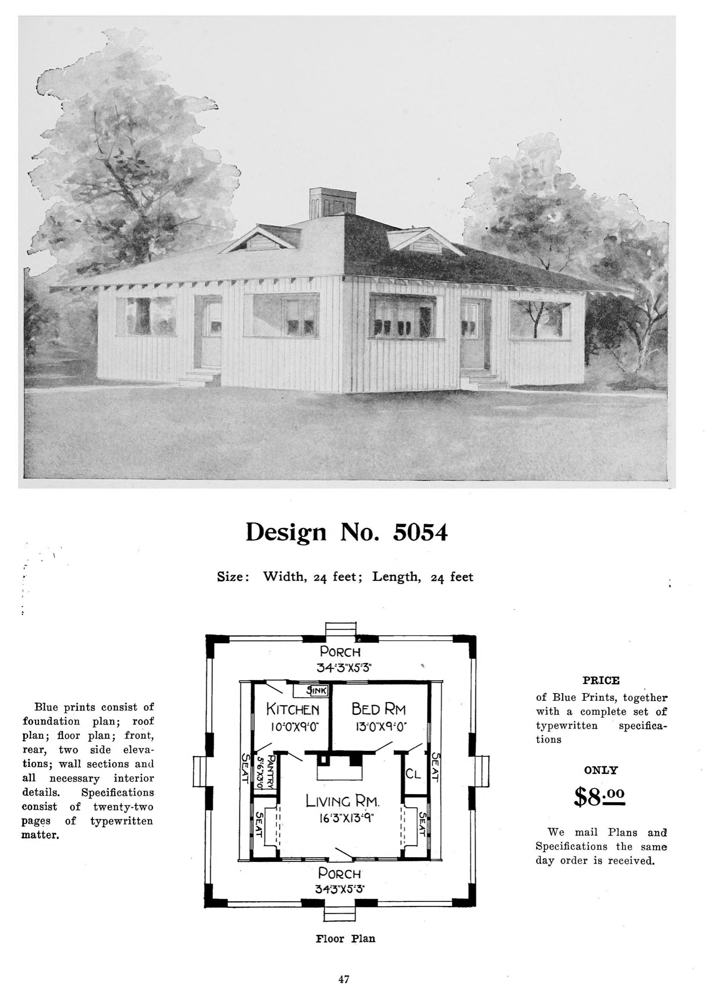

- **Style / era:** Vernacular cottage (minimal hip-roof), 1908
- **Type:** single-family house | **Country:** United States
- **Creator:** Radford Architectural Company | **Source:** Internet Archive (Cornell University Library scan); published 1908, public domain by age
- **License:** [Public Domain](https://archive.org/details/cu31924014996395)
- **Source page:** [link](https://archive.org/details/cu31924014996395) | **Full-res file:** [link](https://archive.org/download/cu31924014996395/page/n50_w1200.jpg)

This sheet pairs a soft watercolor perspective of a low hip-roofed cottage with a single labeled floor plan beneath it. The note at the top fixes the footprint precisely: width 24 feet, length 24 feet, a perfect square. It is about as small and plain as a complete house plan gets, which makes it an ideal baseline test case for the editor.

The plan itself is almost diagrammatic. The square shell holds just three interior rooms: a Kitchen (10'0" x 9'0") and a Bed Room (13'0" x 9'0") across the rear, and a Living Room (16'3" x 13'9") spanning the front. A small Pantry (5'6" x 3'0") with a sink notch is tucked beside the kitchen, and a single Closet (CL) sits between the bedroom and the living room. Every room is a plain rectangle, and the partitions meet at right angles. Room names and dimensions are lettered directly into each space.

The one wrinkle worth noting is that the square is wrapped front and rear by two shallow porches, each labeled 34'3" x 5'3" and drawn with a colonnade of square posts rather than full walls. These are roofed-but-open spaces, not enclosed rooms, and several built-in "SEAT" benches line their edges. The porches read clearly as covered outdoor space rather than additional interior area.

Because the walls are all straight, the rooms are all rectangular, and there is a single story with no stairs, the interior is fully representable with the shipped two-dimensional editor. The only feature that does not map cleanly to an enclosed room is the open porch ring around the house.

**Notable features**

- perfectly square 24'x24' footprint
- only three rectangular rooms (kitchen, bedroom, living room)
- small pantry with sink notch and a single closet
- front and rear open porches with square-post colonnades
- built-in 'SEAT' benches along the porches
- all right-angle partitions, single story
- room names and dimensions lettered in each space

**Supported today:** straight walls at right angles, rectangular rooms derived from walls, room naming and room labels, thickness-aware clear floor area, interior door openings and a sink fixture symbol, linear dimensions in imperial units.

**On the roadmap:** furniture/fixture placement (built-in porch seats, kitchen sink).

**Not yet supported today (gaps). Draft feature requests:**

- [Covered outdoor rooms (porches, verandas, breezeways)](../../../vernacular-planning/feature-covered-outdoor-rooms.md): front and rear porches are roofed-but-open colonnaded spaces, not fully wall-enclosed rooms

---

## 02. Radford's Artistic Bungalows, Design No. 5085 (floor plan)

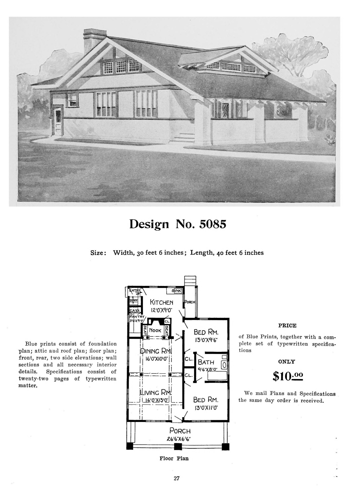

- **Style / era:** Craftsman bungalow, 1908
- **Type:** single-family house | **Country:** United States
- **Creator:** Radford Architectural Company | **Source:** Internet Archive (Cornell University Library scan); published 1908, public domain by age
- **License:** [Public Domain](https://archive.org/details/cu31924014996395)
- **Source page:** [link](https://archive.org/details/cu31924014996395) | **Full-res file:** [link](https://archive.org/download/cu31924014996395/page/n30_w1200.jpg)

This page presents a textbook one-story Craftsman bungalow. A watercolor perspective at the top shows the low-slung gabled house with deep eaves, exposed rafter tails, and a broad front porch, and a single labeled floor plan sits below it. The overall footprint is given as 30 feet 6 inches wide by 40 feet 6 inches long.

The plan is a clean, almost entirely rectilinear arrangement of rooms. Along one side, front to back, run the Living Room (16'0" x 13'0"), the Dining Room (16'0" x 10'0"), and the Kitchen (12'0" x 9'0"), with a small Pantry (3'6" x 9'0") and a breakfast Nook off the kitchen. The opposite side holds two bedrooms, a front Bed Room (13'0" x 9'6") and a rear Bed Room (13'0" x 11'0"), with a Bath (9'6" x 8'0") between them. Several Closets (CL) are stacked along the central spine, an entry vestibule with a stair labeled "DOWN" sits at the front corner, and there is a small rear service Porch off the kitchen.

A deep front Porch (26'6" x 6'6") spans most of the front of the house, drawn as an open colonnaded space rather than an enclosed room. Door swings and a bathtub/toilet fixture grouping in the bath are indicated in the linework, and every room carries a name and imperial dimensions.

This is a strong mainstream baseline case: all walls are straight and meet at right angles, all rooms are simple rectangles, and the layout is a single story. The interior maps directly onto the shipped editor. The one element that does not become an enclosed room is the open front porch, and the "DOWN" stair hints at a basement that the single sheet does not draw.

**Notable features**

- classic one-story Craftsman bungalow, 30'6"x40'6"
- living/dining/kitchen run down one side, two bedrooms and bath down the other
- breakfast nook and pantry off the kitchen
- stacked closets along a central spine
- deep open front porch plus small rear service porch
- entry vestibule with a 'DOWN' stair to a basement
- bath fixture grouping (tub/toilet) indicated

**Supported today:** straight walls at right angles, rectangular rooms derived from walls, room naming and labels for many rooms, interior and exterior door openings with swings, linear dimensions in imperial units, thickness-aware clear floor area.

**On the roadmap:** fixture placement (tub, toilet, kitchen sink), floor management / basement level implied by the 'DOWN' stair, straight-run stairs.

**Not yet supported today (gaps). Draft feature requests:**

- [Covered outdoor rooms (porches, verandas, breezeways)](../../../vernacular-planning/feature-covered-outdoor-rooms.md): the deep front porch and rear service porch are roofed-but-open spaces, not enclosed rooms

---

## 03. Cottages and Semi-Bungalows, Design No. 208 (first and second floor plans)

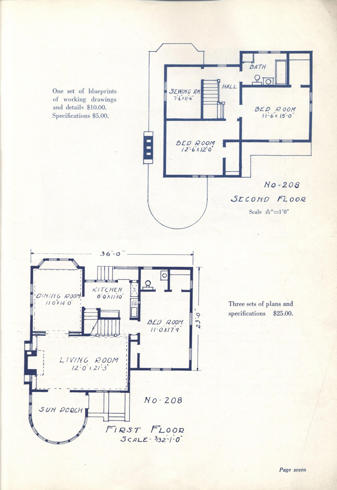

- **Style / era:** Craftsman semi-bungalow (1920s), 1920
- **Type:** single-family house | **Country:** United States
- **Creator:** J. W. Lindstrom (architect/publisher) | **Source:** Internet Archive (Public Domain Mark 1.0); originally J. W. Lindstrom, Minneapolis, 1920
- **License:** [Public Domain Mark 1.0](http://creativecommons.org/publicdomain/mark/1.0/)
- **Source page:** [link](https://archive.org/details/JWLindstromCottagesandsemibungalow0001) | **Full-res file:** [link](https://archive.org/download/JWLindstromCottagesandsemibungalow0001/page/n8_w1200.jpg)

This blueprint-style plate shows both the first and second floor plans of Design No. 208, a 1920s Craftsman semi-bungalow, drawn in blue line on cream paper. The first floor is dimensioned at 36'0" wide by 23'0" deep. The two plans are stacked on the page, the second floor above and the first floor below, each with its own scale note.

The reason this plan is interesting is its curved geometry. The first floor's most distinctive element is a SUN PORCH at the front corner whose outer wall is a true semicircular bow, drawn as a smooth arc of paired window mullions rather than straight segments. Above it on the second floor, a corresponding bedroom and a small bay extend over the porch line with an angled, canted projection. The Dining Room on the first floor also carries a projecting bay with chamfered corners. These rounded and angled features are the heart of the test case: they cannot be represented as plain rectilinear rooms.

The conventional rooms are otherwise straightforward rectangles with labeled sizes. The first floor holds a Living Room (12'0" x 21'3"), Dining Room (11'0" x 14'0"), Kitchen (8'0" x 11'0"), and a first-floor Bed Room (11'0" x 17'9"), arranged around a central straight-run stair. The second floor adds a Sewing Room (7'6" x 11'6"), two Bed Rooms (12'6" x 12'0" and 11'6" x 15'0"), a Hall, and a Bath with plumbing fixtures drawn in.

As a two-story plan with stacked floors and a straight-run stair, most of this house is roadmap territory rather than gap territory. The genuine gap is the curved exterior wall of the semicircular sun porch (and the bowed/canted bays), which the straight-segment wall model cannot reproduce. The sun porch is also an open, glazed outdoor room rather than a fully enclosed space.

**Notable features**

- semicircular bowed sun porch with a true curved outer wall
- canted/angled bay projecting over the porch on the second floor
- chamfered projecting bay on the dining/sewing rooms
- first and second floor plans on one plate
- central straight-run stair tying the two floors
- first-floor bedroom in addition to upstairs bedrooms
- bath with plumbing fixtures drawn in
- blue-line blueprint rendering on cream stock

**Supported today:** straight walls at right angles for the conventional rooms, rectangular rooms derived from walls with labels and sizes, interior door openings, linear dimensions in imperial units, raster underlay tracing of the blueprint.

**On the roadmap:** multi-floor management (stacked first and second floors), straight-run stairs with floor-spanning topology, fixture placement in the bath.

**Not yet supported today (gaps). Draft feature requests:**

- [Curved and non-linear walls](../../../vernacular-planning/feature-curved-and-nonlinear-walls.md): the sun porch outer wall is a true semicircular arc and the dining/upper bays are bowed/canted, none of which the straight-segment wall model can represent
- [Covered outdoor rooms (porches, verandas, breezeways)](../../../vernacular-planning/feature-covered-outdoor-rooms.md): the glazed sun porch is an open roofed space, not a fully wall-enclosed interior room

---

## 04. Cottages and Semi-Bungalows, Design No. 209 (first and second floor plans)

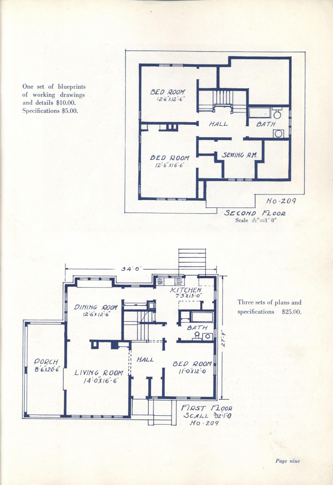

- **Style / era:** American Foursquare / modest two-story (1920s), 1920
- **Type:** single-family house | **Country:** United States
- **Creator:** J. W. Lindstrom (architect/publisher) | **Source:** Internet Archive (Public Domain Mark 1.0); originally J. W. Lindstrom, Minneapolis, 1920
- **License:** [Public Domain Mark 1.0](http://creativecommons.org/publicdomain/mark/1.0/)
- **Source page:** [link](https://archive.org/details/JWLindstromCottagesandsemibungalow0001) | **Full-res file:** [link](https://archive.org/download/JWLindstromCottagesandsemibungalow0001/page/n10_w1200.jpg)

This blue-line plate gives the first and second floor plans of Design No. 209, a modest two-story house in the American Foursquare lineage. The first floor measures 34'0" wide by 27'0" deep, drawn as a compact, nearly square box. The two plans are stacked on the page, the second floor above and the first floor below, each with its own scale note.

The first floor is a clean rectilinear arrangement around a central straight-run stair and Hall. A large Living Room (14'0" x 16'6") and Dining Room (12'6" x 12'6") occupy the front and one side, with a Kitchen (7'3" x 13'0"), a Bath, and a first-floor Bed Room (11'0" x 12'0") filling out the rear. A long open Porch (8'6" x 20'6") runs down one side of the house, drawn with posts rather than enclosing walls. The second floor stacks two Bed Rooms (12'6" x 12'6" and 12'6" x 16'6"), a Sewing Room, a central Hall, and a Bath with fixtures.

Every interior room here is a simple rectangle, all partitions meet at right angles, and the only vertical circulation is a conventional straight-run stair. Door swings and bathroom fixtures are indicated in the linework, and rooms are labeled with names and imperial dimensions.

This is a useful "true two-story box" baseline that balances the single-story bungalows in the set. Its interior is fully representable once multi-floor management and straight-run stairs (both on the roadmap) are available. The only element that is not an enclosed room is the open side porch.

**Notable features**

- compact roughly-square two-story Foursquare-type box, 34'0"x27'0"
- first and second floor plans on one plate
- central straight-run stair and hall
- first-floor bedroom and bath plus full upper floor of bedrooms
- sewing room on the second floor
- long open side porch drawn with posts
- all rectangular rooms at right angles
- blue-line blueprint rendering

**Supported today:** straight walls at right angles, rectangular rooms derived from walls with labels and sizes, interior door openings with swings, linear dimensions in imperial units, raster underlay tracing of the blueprint.

**On the roadmap:** multi-floor management (stacked first and second floors), straight-run stairs with floor-spanning topology, fixture placement in the baths.

**Not yet supported today (gaps). Draft feature requests:**

- [Covered outdoor rooms (porches, verandas, breezeways)](../../../vernacular-planning/feature-covered-outdoor-rooms.md): the long side porch is a roofed-but-open space drawn with posts, not a wall-enclosed room

---

## 05. Aladdin Homes Catalog No. 29, 'The Venus' (first and second floor plans)

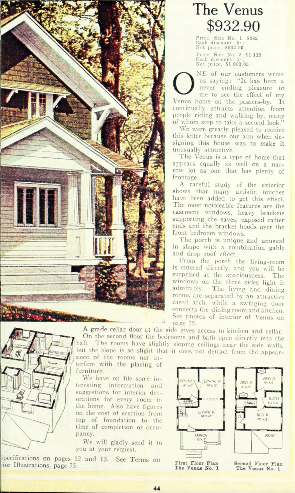

- **Style / era:** Craftsman bungalow, two-story, 1917
- **Type:** single-family house (kit/catalog home) | **Country:** United States
- **Creator:** Aladdin Company (Bay City, Michigan) | **Source:** Internet Archive scan; Aladdin Co. Catalog No. 29, 1917, public domain by age
- **License:** [Public Domain](https://archive.org/details/aladdinhomes00alad)
- **Source page:** [link](https://archive.org/details/aladdinhomes00alad) | **Full-res file:** [link](https://archive.org/download/aladdinhomes00alad/page/n50_w1200.jpg)

This is a full catalog page for "The Venus," a two-story Craftsman kit bungalow offered by the Aladdin Company. Most of the sheet is a photograph of the built house and several columns of marketing copy, with a small cutaway isometric and the two working floor plans grouped at the lower right. The plans are compact and labeled with room names and small dimensions.

The First Floor Plan holds a Kitchen (8' x 12'), a Dining Room (10' x 12'), and a large Living Room (18' x 12'), with a front Porch (13' x 7'). A straight-run stair sits in the center of the plan; the surrounding text notes a grade cellar door under the main stair and access from the stair landing down to a cellar and up to the bedrooms, so this house has a basement level in addition to its two stories. The Second Floor Plan shows three Bed Rooms (8' x 12', 10' x 9', and 15' x 9'), a Bath (6'6" x 6'), and a closet (CL).

The most notable feature for testing is the second floor itself: a large portion of it is labeled "ROOF" and drawn with diagonal hatching, meaning the upper story only partly covers the footprint and the rest is open sloping roof. The marketing copy explicitly mentions that the upstairs rooms have slightly sloping ceilings, consistent with a story-and-a-half bungalow tucked under the gable. An arched opening between the living and dining rooms is described in the text.

The conventional rooms are all simple rectangles with right-angle walls, so the room layouts themselves are straightforward. The features that push beyond current and roadmap support are the partial upper floor that exists under sloping roof planes rather than a full flat-ceilinged story, the sloped attic ceilings, and the curved (arched) interior opening.

**Notable features**

- two floor plans plus a cutaway isometric on one catalog page
- story-and-a-half bungalow with a partial second floor
- large 'ROOF' area hatched on the upper plan (open sloping roof)
- slightly sloping upstairs ceilings noted in the copy
- grade cellar door and basement access under the main stair
- central straight-run stair serving cellar and bedrooms
- arched opening between living and dining rooms
- front porch and three upstairs bedrooms with a bath

**Supported today:** straight walls at right angles, rectangular rooms derived from walls with labels and sizes, interior door openings, linear dimensions in imperial units.

**On the roadmap:** multi-floor management (cellar plus two stories), straight-run stairs with floor-spanning topology, arched interior opening (curved/period door shapes), fixture placement in the bath.

**Not yet supported today (gaps). Draft feature requests:**

- [Roof and sloped-ceiling geometry](../../../vernacular-planning/feature-roof-and-sloped-ceiling-geometry.md): the upper floor is a partial story under hatched roof planes with slightly sloping (attic knee-wall) ceilings, which is roof/sloped-ceiling geometry rather than a flat per-room height
- [Covered outdoor rooms (porches, verandas, breezeways)](../../../vernacular-planning/feature-covered-outdoor-rooms.md): the front porch is a roofed-but-open space, not a wall-enclosed room

---

## 06. Palliser's American Cottage Homes, Plate 4 (Designs 7 and 8)

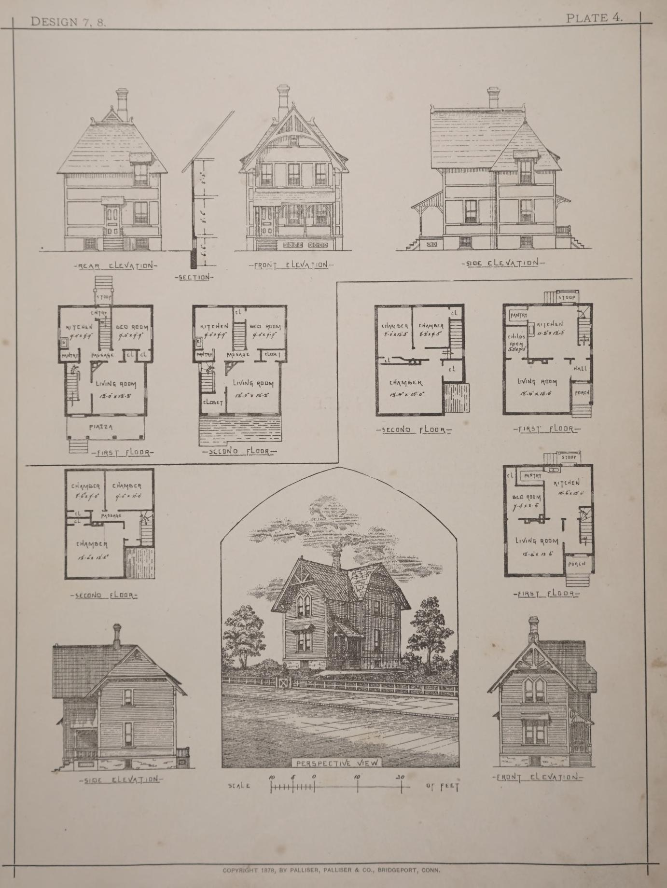

- **Style / era:** Victorian (Stick/Gothic cottage), 1878
- **Type:** single-family house | **Country:** United States
- **Creator:** Palliser, Palliser & Co. | **Source:** Internet Archive (Clatsop County Historical Society); published 1878, public domain by age
- **License:** [Public Domain](https://archive.org/details/palliser.cottagehomes.1878)
- **Source page:** [link](https://archive.org/details/palliser.cottagehomes.1878) | **Full-res file:** [link](https://archive.org/download/palliser.cottagehomes.1878/page/n10_w1200.jpg)

This is a dense 1878 engraved pattern-book plate, "Plate 4," presenting two distinct small Victorian cottage designs, numbered 7 and 8, on a single sheet. The page is packed: it carries front, side, and rear elevations, a vertical section, a large central perspective view of a steep-gabled Gothic-cottage rendering, and several small floor plans, all surrounded by a ruled border. A graphic scale bar reading "SCALE ... OF FEET" runs across the bottom center, and the plate is dated by its expired "Copyright 1878 by Palliser, Palliser & Co." line.

The floor plans are the dense engraved blocks. Each design gets a first-floor and a second-floor plan, so the sheet shows four plans plus extra variant blocks. Design 7 is the smaller cottage, with a Kitchen, Bed Room, Living Room, Pantry, a central Passage, and several closets, fronted by a PIAZZA (an open columned porch). Design 8 is a bit larger, with a Pantry, Kitchen, a China/Scullery room, a Living Room, a Hall, and a Porch with an entry stoop on the first floor, and three Chambers with closets above. Room sizes are lettered in tiny script inside each room (for example a living room marked roughly 15'4" x 15'8").

The interior rooms are all simple straight-walled rectangles arranged at right angles, so each individual floor plan is well within the editor's reach. What makes this plate a distinctive test case is its packaging: it is a single sheet carrying two completely separate buildings, each with multiple floors, alongside elevations, a section, and a perspective. The rooms are also sized indirectly through a graphic scale bar rather than only through dimension strings, and each cottage fronts an open piazza or porch that is covered outdoor space rather than an enclosed room.

The genuine gaps therefore live in the annotation and outdoor-space layers rather than in the room geometry: the graphic scale bar as a plan annotation, and the open piazza/porch spaces. The two-designs-on-one-sheet packaging and the multi-floor stacking are organizational concerns, with discrete floors already covered by the roadmap.

**Notable features**

- single 1878 plate carrying two separate cottage designs (7 and 8)
- first- and second-floor plans for each design, four plans total
- elevations, a section, and a central perspective on the same sheet
- graphic scale bar ('SCALE ... OF FEET') at the bottom
- open piazza on Design 7 and a porch with entry stoop on Design 8
- tiny engraved room labels and dimensions
- small workman-style rooms: kitchen, pantry, scullery/china room, chambers
- steep Gothic-cottage massing in the rendering

**Supported today:** straight walls at right angles, rectangular rooms derived from walls with labels and sizes, room naming and labels, interior door openings, linear dimensions in imperial units, raster underlay tracing of the engraved plans.

**On the roadmap:** multi-floor management (first and second floors for each design), straight-run stairs.

**Not yet supported today (gaps). Draft feature requests:**

- [Plan annotations: north arrow and scale bar](../../../vernacular-planning/feature-plan-annotations-north-arrow-scale-bar.md): the plate dimensions its plans through a graphic scale bar across the bottom, which the editor has no annotation for
- [Covered outdoor rooms (porches, verandas, breezeways)](../../../vernacular-planning/feature-covered-outdoor-rooms.md): Design 7's piazza and Design 8's porch/stoop are open columned spaces, not wall-enclosed rooms

---

## 07. Cunningham Cabin Floor Plan, Grand Teton NP (HABS WYO-25, sheet 2)

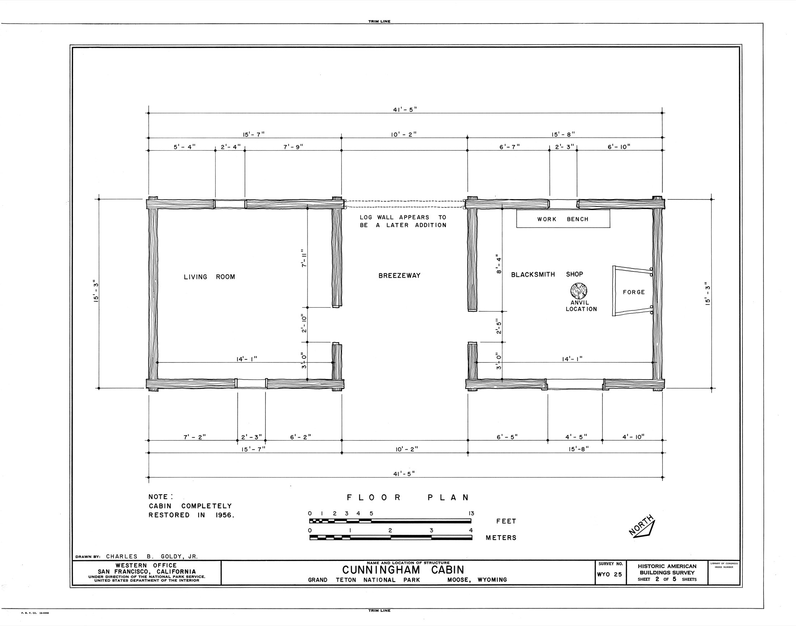

- **Style / era:** Frontier log dog-trot cabin, ca. 1888 (restored 1956); HABS drawings
- **Type:** single-family cabin (tiny / dog-trot homestead) | **Country:** United States
- **Creator:** Historic American Buildings Survey (HABS WYO-25), delineated by Charles B. Goldy Jr. | **Source:** Library of Congress HABS, via Wikimedia Commons (public domain US Government work)
- **License:** [US Government Work / Public Domain](<https://commons.wikimedia.org/wiki/File:Floor_Plan_-_Cunningham_Cabin,_Between_Snake_River_and_U.S._Route_89,_Moose,_Teton_County,_WY_HABS_WYO,20-MOOS.V,2-_(sheet_2_of_5).png>)
- **Source page:** [link](https://www.loc.gov/pictures/item/wy0038.sheet/) | **Full-res file:** [link](https://commons.wikimedia.org/wiki/Special:FilePath/Floor%20Plan%20-%20Cunningham%20Cabin%2C%20Between%20Snake%20River%20and%20U.S.%20Route%2089%2C%20Moose%2C%20Teton%20County%2C%20WY%20HABS%20WYO%2C20-MOOS.V%2C2-%20%28sheet%202%20of%205%29.png)

The Cunningham Cabin is a classic frontier dog-trot homestead recorded by the Historic American Buildings Survey at Grand Teton National Park. The plan is tiny and almost diagrammatic: two square log pens stand at either end of a single rectangular footprint measuring just 41 feet 5 inches by 15 feet 3 inches. The left pen is labeled Living Room, the right pen is a Blacksmith Shop with an Anvil Location, a Work Bench, and a wedge-shaped Forge drawn into one corner. Between them sits an open BREEZEWAY, the central dog-trot passage that is roofed but unenclosed on its long sides.

The walls are rendered as thick log members with the characteristic squared-log hatching of round or hewn timber, and a note flags that one log wall "appears to be a later addition." Each pen has a single door opening onto the breezeway, drawn as a simple gap in the log wall rather than a swing symbol. The drawing carries complete running dimension chains across the top and bottom and down both ends, a north arrow in the lower right, and two stacked graphic scale bars, one in feet and one in meters.

This is a deliberately simple, small-footprint vernacular case that is valuable precisely because of its open central passage. The two pens themselves are ordinary straight-walled rectangular rooms that Vernacular can represent today, and the dual feet-and-meter scale bars exercise unit handling and underlay calibration. What it cannot represent cleanly is the dog-trot breezeway itself: a roofed-but-open space that is not a fully wall-enclosed room. The thick log construction is a separate matter that the wall-construction-profile roadmap track is meant to cover.

**Notable features**

- dog-trot plan: two log pens flanking an open central breezeway
- tiny footprint, 41'-5" x 15'-3"
- thick hewn/round log walls with timber hatching
- blacksmith-shop pen with forge, anvil, and work bench callouts
- complete running dimension chains on all four sides
- north arrow plus dual feet-and-meter graphic scale bars
- note flagging a log wall as a later addition

**Supported today:** straight log walls with wall thickness, two rectangular rooms (Living Room, Blacksmith Shop), simple door openings as gaps in the log walls, linear running dimensions in imperial units, dual imperial and metric scale bars for underlay calibration.

**On the roadmap:** wall construction profiles for thick log walls and poché, site/textual metadata for the forge and work bench fixtures, furniture/fixture placement (forge, anvil, work bench).

**Not yet supported today (gaps). Draft feature requests:**

- [Covered outdoor rooms (porches, verandas, breezeways)](../../../vernacular-planning/feature-covered-outdoor-rooms.md): the central BREEZEWAY is a roofed-but-open dog-trot passage that must be drawable as a space without being a fully wall-enclosed room
- [Plan annotations: north arrow and scale bar](../../../vernacular-planning/feature-plan-annotations-north-arrow-scale-bar.md): the sheet carries a north arrow and dual feet/meter graphic scale bars as plan annotations

---

## 08. Log Cabin Tavern, First and Second Floor Plans (HABS AR-32-10, sheet 1)

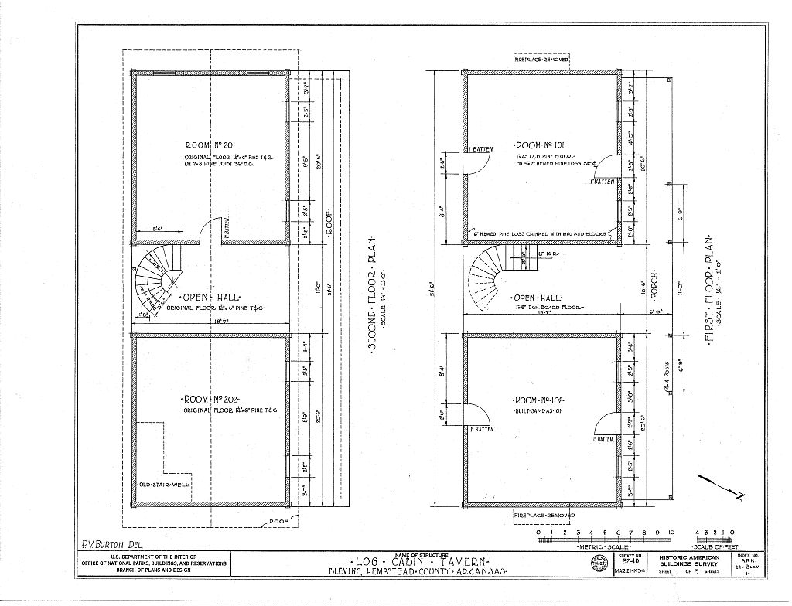

- **Style / era:** Log / rustic vernacular (dogtrot 'open hall'), early-to-mid 19th century log construction; HABS drawings documented after 1933
- **Type:** single-family dwelling / tavern (two-story log) | **Country:** United States
- **Creator:** Historic American Buildings Survey; delineators P. V. Burton and H. M. Black | **Source:** Library of Congress HABS
- **License:** [US Government Work](https://www.loc.gov/rr/print/res/114_habs.html)
- **Source page:** [link](https://www.loc.gov/item/ar0005/) | **Full-res file:** [link](https://tile.loc.gov/storage-services/service/pnp/habshaer/ar/ar0000/ar0005/sheet/00001v.jpg)

The Log Cabin Tavern is a simple two-story hewn-log dwelling that also served as a tavern, documented by the Historic American Buildings Survey in Hempstead County, Arkansas. This single sheet places the First Floor Plan and the Second Floor Plan side by side. Each floor is a narrow rectangle divided into two rooms separated by a central OPEN HALL, the dogtrot-style passage that runs through the middle of the building. On the first floor the rooms are Room No. 101 and Room No. 102; on the second they are Room No. 201 and Room No. 202. Construction notes describe hewn pine logs chinked with mud and bucks, tongue-and-groove pine floors over hewn pine joists, and call out features such as a removed fireplace and a covered PORCH along one long side.

Circulation between floors is handled by a tight spiral stair set in the open hall, drawn as a circle with radiating wedge-shaped treads and an "UP 16 R" note; the matching second-floor drawing shows the head of the same winding stair plus an OLD STAIR WELL marked in one corner. The plans are dimensioned with short imperial chains around the rooms and door swings are shown at the room openings. A combined metric and imperial scale bar sits at the bottom, and a north arrow is drawn near the first-floor plan.

The rectangular log rooms, the door and porch openings, and the imperial dimensioning are all squarely within what Vernacular supports today, and the two stacked floor plans are a good exercise for the roadmap's multi-floor management. Two features push beyond both the shipped editor and the committed roadmap. The central open hall is again a roofed dogtrot passage that needs to be drawn as an open space rather than an enclosed room, and the spiral stair is winding, not straight-run, geometry. As with the other log examples, the thick log walls themselves fall under the wall-construction-profile roadmap track rather than being a gap.

**Notable features**

- two-story hewn-log dwelling with first and second floor plans on one sheet
- central OPEN HALL dogtrot passage on both floors
- spiral/winding stair in the open hall with UP 16 R note
- covered PORCH along one long side
- four numbered rooms (101/102 below, 201/202 above) plus an old stair well
- construction notes: hewn pine logs chinked with mud and bucks
- removed-fireplace callouts and door swings at room openings
- combined imperial and metric scale bar with a north arrow

**Supported today:** straight log walls with thickness and junctions, rectangular rooms with room labels, single-swing door openings with swing arcs, linear imperial dimension chains, a single active floor at a time.

**On the roadmap:** floor management (two stacked stories on one sheet), wall construction profiles for hewn-log walls, covered-porch handling via the period vocabulary tracks.

**Not yet supported today (gaps). Draft feature requests:**

- [Covered outdoor rooms (porches, verandas, breezeways)](../../../vernacular-planning/feature-covered-outdoor-rooms.md): the central OPEN HALL dogtrot passage and the side PORCH are roofed-but-open spaces, not fully enclosed rooms
- [Vertical circulation beyond straight stairs (elevators, spiral stairs, ramps)](../../../vernacular-planning/feature-vertical-circulation-beyond-stairs.md): the open-hall stair is a spiral/winding stair, not a straight-run stair

---

## 09. Lucero House, Floor Plan and Roof/Vega Plan (HABS NM-129, sheet 2)

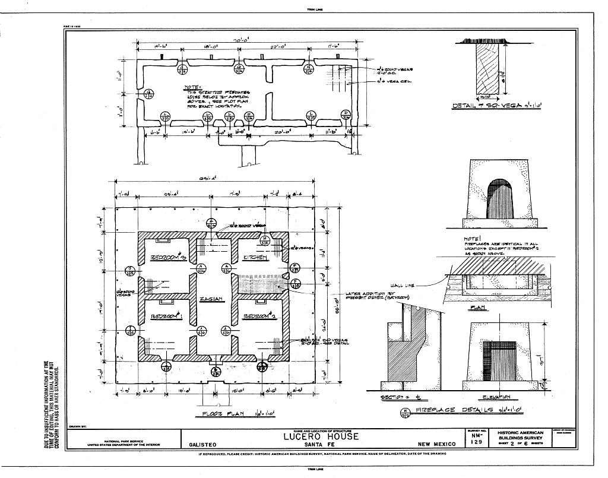

- **Style / era:** Spanish Colonial / New Mexico adobe, vernacular adobe (19th century); HABS drawings documented after 1933
- **Type:** single-family house (adobe dwelling) | **Country:** United States
- **Creator:** Historic American Buildings Survey | **Source:** Library of Congress HABS
- **License:** [US Government Work](https://www.loc.gov/rr/print/res/114_habs.html)
- **Source page:** [link](https://www.loc.gov/item/nm0034/) | **Full-res file:** [link](https://tile.loc.gov/storage-services/service/pnp/habshaer/nm/nm0000/nm0034/sheet/00002v.jpg)

The Lucero House is a Spanish Colonial adobe dwelling near Galisteo and Santa Fe, New Mexico, recorded by the Historic American Buildings Survey. The main Floor Plan, at lower left, is a compact roughly square block of very thick adobe walls drawn with dense diagonal hatching that conveys the mass of the masonry. Inside are four labeled rooms arranged around a central spine: two Bedrooms, a Kitchen, and a second Bedroom, with a ZAGUAN, the covered through-passage, running between them and connecting the front and rear of the house. A note and lighter wall hatching identify a later Bedroom addition by the present owner at one corner.

The sheet is a combined drawing rather than a single plan. Above the floor plan is a vega (ceiling-beam) plan showing the rows of round log roof beams and their spacing, and at the right are fireplace details including a section, an elevation, and a small plan of the corner adobe fireplaces, with a note that the fireplaces are identical in all locations except one bedroom. Circled symbols throughout key the openings and beams to the schedules, and imperial dimension chains run around the floor plan.

The four adobe rooms read as ordinary straight-walled rectangular spaces that Vernacular can model today, and the thick hatched walls are exactly the kind of masonry that the wall-construction-profile and poché roadmap track is meant to handle, so the wall mass is not itself a gap. The one feature that exceeds both the shipped editor and the roadmap is the zaguán: a roofed covered passage cut through the body of the house that needs to be drawn as an open space rather than a fully enclosed room. The corner fireplaces are fixtures that belong to the furniture-and-fixture roadmap, and the vega plan is essentially a second overlay sheet rather than a distinct gap.

**Notable features**

- very thick adobe walls drawn with dense diagonal poché hatching
- ZAGUAN covered through-passage running between the rooms
- four labeled rooms (two Bedrooms, Kitchen, Bedroom) around a central spine
- later bedroom addition flagged with lighter wall hatching
- combined sheet: floor plan plus a vega (ceiling-beam) roof plan
- corner adobe fireplace details (section, elevation, plan)
- circled keys tying openings and beams to schedules

**Supported today:** straight adobe walls with substantial thickness and junctions, rectangular rooms with room labels, linear imperial dimension chains, raster underlay calibration from the floor-plan portion of the sheet.

**On the roadmap:** wall construction profiles and poché for thick adobe masonry, furniture/fixture placement for the corner adobe fireplaces, site/textual metadata for the addition note.

**Not yet supported today (gaps). Draft feature requests:**

- [Covered outdoor rooms (porches, verandas, breezeways)](../../../vernacular-planning/feature-covered-outdoor-rooms.md): the ZAGUAN is a roofed covered passage cut through the house that must be drawable as an open space, not a fully enclosed room

---

## 10. Floor plan of a Murut longhouse (Borneo)

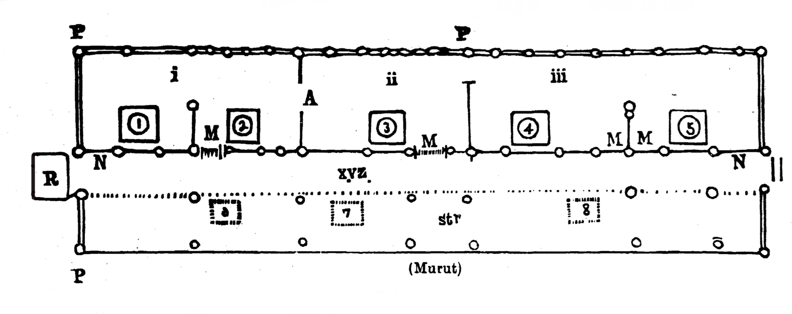

- **Style / era:** Southeast Asian vernacular, 1912
- **Type:** longhouse (communal dwelling) | **Country:** Malaysia (Borneo)
- **Creator:** J. C. Moulton | **Source:** Public-domain ethnographic plate (1912, Journal of the Straits Branch of the Royal Asiatic Society); via Wikimedia Commons
- **License:** [Public Domain](https://commons.wikimedia.org/wiki/File:Floor_plan_of_a_Murut_longhouse.png)
- **Source page:** [link](https://commons.wikimedia.org/wiki/File:Floor_plan_of_a_Murut_longhouse.png) | **Full-res file:** [link](https://commons.wikimedia.org/wiki/Special:FilePath/Floor_plan_of_a_Murut_longhouse.png?width=1600)

This is an ethnographic plate of a Murut longhouse from Borneo, published in 1912, and it depicts a communal dwelling whose logic is utterly different from a Western single-family house. The plan is long, narrow, and strongly linear: a continuous raised structure carried on rows of posts (the building is a pile dwelling, shown by the rings of post points along its length). The upper band of the drawing is a covered gallery shared by the whole community, and off it runs a row of repeated private family compartments, each centered on a hearth drawn as a small square frame containing a numbered circle (1 through 5). The bays are grouped into labeled sections (i, ii, iii), and lettered annotations mark recurring elements: M for partitions or mats between families, N for the notched-log ladders and entry posts, P for the main posts, and R for an enclosed room at one end.

Below the family compartments a second long band labeled "str" runs the full length of the house, a lower gallery or street-like circulation strip with its own platforms and sleeping areas numbered 6, 7, and 8. The whole composition is essentially a single module repeated down a corridor, with the shared gallery serving as the communal spine that ties the separate family units together.

This plan is the clearest multi-unit case in the set. It is one structure that houses many separate dwelling units served by a shared gallery, which the model, assuming a single residence, cannot represent. The continuous covered gallery and street are themselves roofed-but-open communal spaces rather than enclosed rooms, so they also exercise the open-space gap. The drawing is schematic and carries no dimensions; room identity is conveyed entirely through the numbered hearth and platform legend rather than through drawn measurements, which is a third distinct gap.

**Notable features**

- long, narrow communal longhouse as a single repeated module
- row of repeated private family compartments each on a numbered hearth (1-5)
- continuous covered gallery serving as the shared communal spine
- lower 'str' gallery/street band with numbered sleeping platforms (6-8)
- pile dwelling carried on rows of posts (post points throughout)
- lettered legend: M partitions/mats, N notched-log ladders, P posts, R end room
- bays grouped into labeled sections i, ii, iii
- schematic, dimensionless ethnographic drawing

**Supported today:** straight walls forming the long rectangular perimeter, repeated rectangular compartments as rooms with labels, marquee selection and copy/paste for the repeated unit modules.

**On the roadmap:** raster underlay tracing of a schematic ethnographic plate.

**Not yet supported today (gaps). Draft feature requests:**

- [Multi-unit dwellings (apartments, duplexes, shared circulation)](../../../vernacular-planning/feature-multi-unit-dwellings.md): one structure houses many separate family compartments served by a shared communal gallery, which the single-residence model cannot represent
- [Covered outdoor rooms (porches, verandas, breezeways)](../../../vernacular-planning/feature-covered-outdoor-rooms.md): the continuous covered gallery and the lower 'str' street are roofed-but-open communal spaces rather than enclosed rooms
- [Room schedules and legends (indirect room sizing)](../../../vernacular-planning/feature-room-schedule-and-legend.md): the plan is dimensionless and conveys unit identity only through numbered hearth and platform legend symbols, not drawn measurements

---

## 11. U.S. Grant House, First Floor Plan (HABS IL-1221, sheet 4)

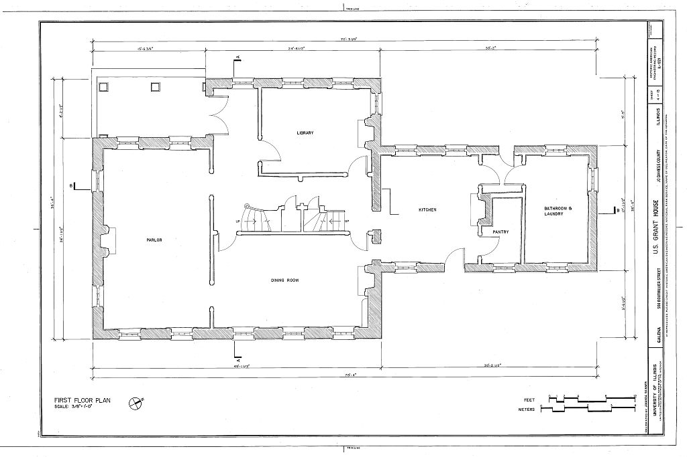

- **Style / era:** Italianate, house built 1859-1860 (architect William Dennison); HABS drawings documented after 1933
- **Type:** single-family house | **Country:** United States
- **Creator:** Historic American Buildings Survey; design architect William Dennison; builders Daniel Farr and Joseph Maefefete | **Source:** Library of Congress HABS
- **License:** [US Government Work](https://www.loc.gov/rr/print/res/114_habs.html)
- **Source page:** [link](https://www.loc.gov/item/il0918/) | **Full-res file:** [link](https://tile.loc.gov/storage-services/service/pnp/habshaer/il/il0900/il0918/sheet/00004v.jpg)

This is the first floor plan of the U.S. Grant House in Galena, Illinois, an Italianate dwelling of 1859 to 1860 recorded by the Historic American Buildings Survey. The plan is a clear, well-mannered example of a mid-nineteenth-century town house. A large Parlor occupies the front left, with the Dining Room directly behind it and a Library across a central hall to the right. Behind the main block, a service wing steps to the rear and holds the Kitchen, a small Pantry, and a combined Bathroom and Laundry. All of the rooms are straightforward rectangles set on a regular grid, and the masonry walls are drawn with hatched poché and carry many window and door openings around the perimeter.

Circulation centers on a generous staircase between the dining and library areas. It is drawn as a U-shaped, dog-leg stair with winder treads fanning around the turn and a curved scrolled bottom step, with "UP" arrows on both flights. The plan is fully dimensioned with running chains across the top and bottom and down the left side, and the lower margin carries a north arrow together with separate feet and meter graphic scale bars.

This is one of the most baseline-friendly plans in the set: rectangular rooms, hatched masonry walls, and a conventional set of doors and windows that the shipped editor handles directly, with multiple stacked floors and the masonry walls themselves belonging to the roadmap. The two genuine gaps are modest. The staircase is not a simple straight run but a winding/winder stair, which is winding-stair geometry beyond what the roadmap commits to, and the sheet carries a north arrow and graphic scale bars as plan annotations. There are no curved walls, porches, or detached outbuildings on this particular sheet.

**Notable features**

- well-mannered Italianate town-house plan with a main block and rear service wing
- labeled rooms: Parlor, Dining Room, Library, Kitchen, Pantry, Bathroom & Laundry
- U-shaped dog-leg stair with winder treads and a scrolled curved bottom step
- hatched masonry walls with many perimeter window and door openings
- full running dimension chains on top, bottom, and left
- north arrow plus separate feet and meter scale bars

**Supported today:** straight masonry walls with thickness and junctions, rectangular rooms with room labels and clear floor area, multiple door and window openings drawn as plan symbols, linear running dimensions in imperial units, dual imperial and metric scale bars for underlay calibration.

**On the roadmap:** floor management (this is one of several stacked levels), wall construction profiles/poché for masonry walls, straight-run portions of the stair as a 2D stair symbol, furniture/fixture placement for bath, laundry, and kitchen fixtures.

**Not yet supported today (gaps). Draft feature requests:**

- [Vertical circulation beyond straight stairs (elevators, spiral stairs, ramps)](../../../vernacular-planning/feature-vertical-circulation-beyond-stairs.md): the main stair turns on winder treads with a curved scrolled bottom step, which is winding-stair geometry beyond a straight run
- [Plan annotations: north arrow and scale bar](../../../vernacular-planning/feature-plan-annotations-north-arrow-scale-bar.md): the sheet carries a north arrow and separate feet/meter graphic scale bars as plan annotations

---

## 12. Emlen Physick House (Estate), First Floor Plan (HABS NJ-746, sheet 3)

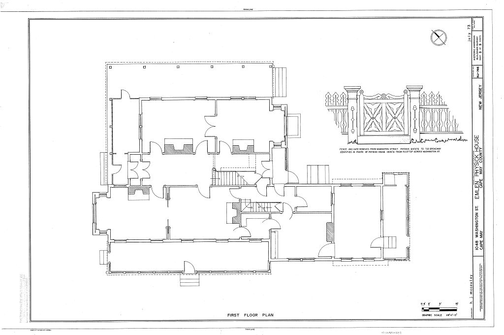

- **Style / era:** Stick Style Victorian, house built 1879 (attributed to Frank Furness); HABS drawings 1973
- **Type:** single-family house (Victorian estate house) | **Country:** United States
- **Creator:** Historic American Buildings Survey; design architect attributed to Frank Furness; delineator H. J. McCauley | **Source:** Library of Congress HABS
- **License:** [US Government Work](https://www.loc.gov/rr/print/res/114_habs.html)
- **Source page:** [link](https://www.loc.gov/item/nj0034/) | **Full-res file:** [link](https://tile.loc.gov/storage-services/service/pnp/habshaer/nj/nj0000/nj0034/sheet/00003v.jpg)

This is the first floor plan of the Emlen Physick House in Cape May, New Jersey, a Stick Style Victorian estate house of 1879 attributed to Frank Furness, as recorded by the Historic American Buildings Survey. The plan shows the restless, picturesque massing typical of the style. The footprint is a complex assembly of rectangular volumes that step in and out, with several projecting bay rooms pushing past the main wall lines and a lower service range extending to the right. Numerous fireplaces are drawn as hatched masonry projections set into the rooms, and the interior is broken into many spaces by partition walls with doors swinging between them.

Vertical circulation is handled by two separate stairs near the center of the plan, each drawn as a run of parallel straight treads with handrails. A roofed porch wraps part of the house: the dashed lines around the upper left and right edges indicate the porch roof and floor extending beyond the enclosed walls, and a stepped stoop projects from the bottom of the plan. A north arrow sits in the upper right, and a graphic scale bar runs along the lower margin. The right portion of the sheet is given over to a separate inset: an elevation detail of the estate's decorative wood fence and gate, with a note that the fence and gate were removed from the property.

Although the massing looks intricate, every wall on the plan is straight; the bays and projections are rectilinear rather than curved, so the room shapes themselves, including L-shaped and angled-bay forms, are representable today, with the masonry walls and the straight-run stairs belonging to the roadmap. The genuine gaps are the roofed porch, a covered-but-open space that needs to be drawn without being a fully enclosed room, and the north arrow and scale bar carried as plan annotations. The numerous fireplaces are fixtures for the furniture roadmap, and the fence elevation is a detail inset rather than part of the building plan.

**Notable features**

- restless Stick Style massing of many stepped rectangular volumes
- multiple projecting bay rooms pushing past the main wall lines
- numerous hatched masonry fireplaces set into the rooms
- two separate straight-run stairs near the plan center
- roofed porch shown by dashed roof/floor lines plus a stepped stoop
- north arrow and graphic scale bar on the sheet
- inset elevation detail of the decorative (now removed) fence and gate

**Supported today:** straight walls at varied angles forming L-shaped and bayed rooms, custom non-rectangular room polygons for the projecting bays, door openings with swing arcs between many partitioned rooms, window openings around the perimeter, raster underlay calibration and the graphic scale bar.

**On the roadmap:** floor management (this is one of several stacked levels), wall construction profiles/poché for masonry walls and chimneys, straight-run stairs as 2D symbols with floor-spanning topology, furniture/fixture placement for the fireplaces, projecting/bay windows that change footprint (named-but-deferred).

**Not yet supported today (gaps). Draft feature requests:**

- [Covered outdoor rooms (porches, verandas, breezeways)](../../../vernacular-planning/feature-covered-outdoor-rooms.md): a roofed porch (shown by dashed roof/floor lines) and a stepped stoop are covered-but-open spaces that must be drawable without full wall enclosure
- [Plan annotations: north arrow and scale bar](../../../vernacular-planning/feature-plan-annotations-north-arrow-scale-bar.md): the sheet carries a north arrow and a graphic scale bar as plan annotations

---

## 13. Charles Mouton House, First and Second Floor Plans (HABS LA-210, sheet 3)

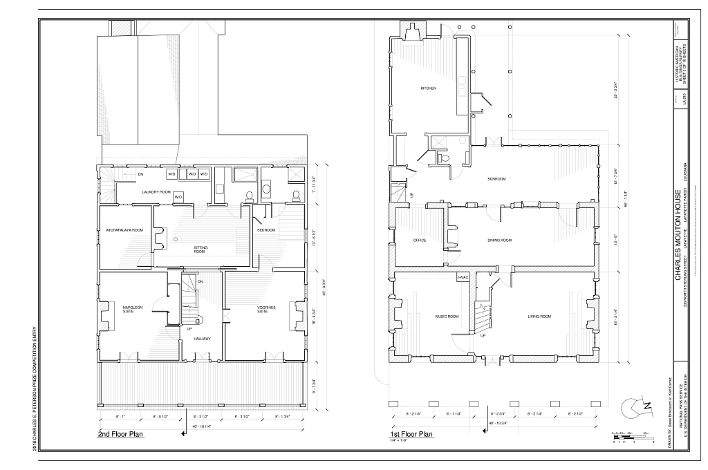

- **Style / era:** Creole / Greek Revival, house 19th century; HABS drawings documented after 1933 (2016 Peterson Prize entry)
- **Type:** single-family house | **Country:** United States
- **Creator:** Historic American Buildings Survey (Charles E. Peterson Prize competition entry) | **Source:** Library of Congress HABS
- **License:** [US Government Work](https://www.loc.gov/rr/print/res/114_habs.html)
- **Source page:** [link](https://www.loc.gov/item/la0774/) | **Full-res file:** [link](https://tile.loc.gov/storage-services/service/pnp/habshaer/la/la0700/la0774/sheet/00003v.jpg)

This HABS sheet presents the Charles Mouton House, a Creole and Greek Revival residence in Lafayette, Louisiana, as a combined drawing carrying both the first-floor plan (right) and the second-floor plan (left) side by side at a quarter-inch scale. Each plan is a rectilinear, roughly square body of rooms wrapped by deep galleries (the Creole porches) along its long sides, with the porch posts drawn as a regular row of square columns and the runs dimensioned along the bottom edge. The first floor reads as a generous public sequence: Living Room, Music Room, Dining Room, Office, and a large Sunroom feeding back to the Kitchen, with a stair marked "UP" and an HVAC closet tucked between the public rooms.

The second floor is a private suite layout, with the Napoleon Suite and Voorhies Suite anchoring the front corners, a central Sitting Room, an Atchafalaya Room, a Bedroom, and a service zone of Laundry Room with stacked washer/dryer symbols and bathrooms. A central stair and hallway connect the two levels. The walls are all straight runs meeting at right angles, the rooms are simple rectangles or straight-edged variants, and every bay carries drawn linear dimensions, so the geometry itself is squarely within what the editor supports today.

The sheet is a clean test of the multi-floor case: two complete stacked plans of the same single building, abundantly named rooms, and the deep gallery porches that ring the house. The galleries are roofed but largely open colonnaded spaces rather than enclosed rooms, so they want to be drawn as covered outdoor space rather than as fully wall-bounded rooms. A companion sheet (sheet 2 of the same HABS set) is a site plan that also shows a separate Garage House, but this particular sheet is confined to the two building plans, so the multi-building and site-geometry dimensions are not exercised here.

**Notable features**

- combined sheet with first-floor and second-floor plans side by side
- deep Creole galleries (colonnaded porches) ringing both long sides
- richly named rooms (Living, Music, Dining, Office, Sunroom, Kitchen; Napoleon and Voorhies Suites, Atchafalaya Room, Sitting Room)
- regular rows of square porch columns with per-bay dimensions
- central stair and hallway linking the two stacked floors
- stacked washer/dryer service zone and HVAC closet
- north arrow and graphic scale annotations

**Supported today:** straight walls at right angles, rectangular and straight-edged rooms derived from walls, room naming and labels, linear point-to-point dimensions in imperial units, door and window plan symbols.

**On the roadmap:** multi-floor (two stacked levels on one sheet), straight-run stairs (floor-spanning), furniture and fixture placement (washer/dryer, plumbing fixtures).

**Not yet supported today (gaps). Draft feature requests:**

- [Covered outdoor rooms (porches, verandas, breezeways)](../../../vernacular-planning/feature-covered-outdoor-rooms.md): the deep Creole galleries are roofed but largely open colonnaded porches that need to be drawn as covered outdoor space rather than fully wall-enclosed rooms

---

## 14. Manship House, Floor Plan with Room Schedule (HABS MS-68, sheet 3)

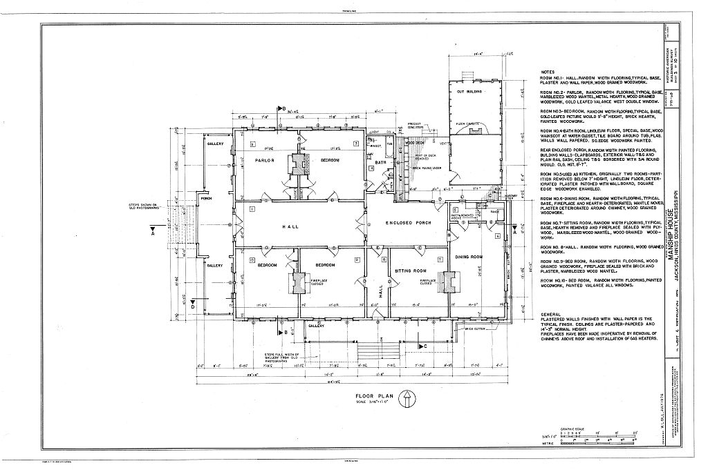

- **Style / era:** Gothic Revival, house built circa 1857; HABS drawings documented 1976
- **Type:** single-family house (Gothic Revival cottage) | **Country:** United States
- **Creator:** Historic American Buildings Survey | **Source:** Library of Congress HABS
- **License:** [US Government Work](https://www.loc.gov/rr/print/res/114_habs.html)
- **Source page:** [link](https://www.loc.gov/item/ms0219/) | **Full-res file:** [link](https://tile.loc.gov/storage-services/service/pnp/habshaer/ms/ms0200/ms0219/sheet/00003v.jpg)

The Manship House is a symmetrical one-story Gothic Revival cottage in Jackson, Mississippi, and this HABS sheet records its single floor plan. The body of the house is a tidy rectangle organized around a wide central Hall, flanked by a Parlor and Bedroom on one side and a pair of Bedrooms with a Sitting Room and Dining Room on the other, with a Bath, an Enclosed Porch, and a kitchen wing extending toward the rear. Front and side Galleries (open porches) wrap the house, and a small detached Out Building is drawn off the rear corner. The walls are straight runs at right angles and the rooms are plain rectangles, so the drawn geometry is entirely conventional.

What makes this plan distinctive is that room identity and finish information are conveyed through a numbered-room legend rather than purely through the drawing. Each space carries a small circled number (rooms 1 through 10), and a long right-hand NOTES table keys those numbers to descriptions: Room No. 1 Hall, No. 2 Parlor, No. 3 Bedroom, No. 4 Bath, the rear Enclosed Porch, No. 6 Kitchen, No. 7 Sitting Room, and so on, each with a paragraph about flooring, base, mantels, wall finish, and woodwork. A general note records the typical plaster-and-wallpaper finishes and the fourteen-foot-three ceiling height.

This is the canonical schedule-driven case in the set: the names and finish data of the rooms live in a tabular legend tied to numbered tags, not in the room polygons themselves, which is exactly the room-schedule-and-legend capability the editor lacks. The detached Out Building introduces a second structure on the property, and the front and side galleries are roofed but open porch spaces rather than enclosed rooms, so both the multi-building and covered-outdoor dimensions are exercised alongside the legend. The sheet also carries a north arrow and both imperial and metric graphic scale bars.

**Notable features**

- numbered-room legend (rooms 1-10) with a right-hand NOTES finish table keyed to circled tags
- symmetrical one-story Gothic Revival cottage around a wide central Hall
- front and side galleries (open porches) plus a rear enclosed porch
- detached out building drawn off the rear corner
- finish schedule describing flooring, base, mantels, wall finish, and woodwork per room
- north arrow and imperial plus metric graphic scale bars

**Supported today:** straight walls at right angles, rectangular rooms derived from walls, room naming and labels, linear point-to-point dimensions in imperial units, door and window plan symbols.

**On the roadmap:** per-room ceiling height (general note records 14'-3" ceilings).

**Not yet supported today (gaps). Draft feature requests:**

- [Room schedules and legends (indirect room sizing)](../../../vernacular-planning/feature-room-schedule-and-legend.md): room identity and finish data are given indirectly through circled numbers keyed to a right-hand notes/schedule table rather than drawn on the rooms themselves
- [Multi-building properties (multiple structures on one site)](../../../vernacular-planning/feature-multi-building-properties.md): a detached out building is drawn off the rear corner, a second structure the single-building model cannot hold
- [Covered outdoor rooms (porches, verandas, breezeways)](../../../vernacular-planning/feature-covered-outdoor-rooms.md): the front and side galleries are roofed but open porch spaces that need to be drawn without being fully wall-enclosed rooms

---

## 15. G. B. Cooley House, Second Floor Plan (HABS LA-1230, sheet 3)

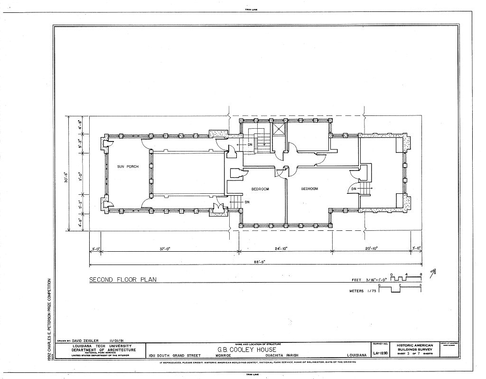

- **Style / era:** Prairie School, house designed 1908 (Walter Burley Griffin); HABS drawings documented 1991
- **Type:** single-family house | **Country:** United States
- **Creator:** Historic American Buildings Survey; design architect Walter Burley Griffin; delineator David Zeigler (and others) | **Source:** Library of Congress HABS
- **License:** [US Government Work](https://www.loc.gov/rr/print/res/114_habs.html)
- **Source page:** [link](https://www.loc.gov/item/la0329/) | **Full-res file:** [link](https://tile.loc.gov/storage-services/service/pnp/habshaer/la/la0300/la0329/sheet/00003v.jpg)

The G. B. Cooley House in Monroe, Louisiana, was designed in 1908 by Walter Burley Griffin, an associate of Frank Lloyd Wright, and this HABS sheet shows its second floor. The plan is a long, low horizontal bar measuring about eighty-eight feet end to end, true to Prairie School massing, with the rooms strung out along that axis. A Sun Porch occupies the left end, two roughly equal Bedrooms sit in the middle, and the structure terminates in a squarer block at the right end. Two separate stairs, each marked "DN," handle the vertical circulation, one near the center and one at the right.

The drawing is geometrically clean and squarely conventional: every wall is a straight run, the corners are right angles, and the walls are punctuated by a regular rhythm of square structural piers drawn as small filled squares along the perimeter. The bays are fully dimensioned along the bottom, with the overall length called out as eighty-eight feet eight inches and the segments broken into thirty-seven, twenty-four, and twenty feet. Both imperial and metric graphic scale bars and a north arrow round out the annotations.

This is one of the deliberately simple, baseline cases in the set. The rooms are plain rectangles derived from straight walls, the piers are point-like fixtures, the openings are ordinary doors and windows, and nothing in the geometry departs from what the editor handles today. The Sun Porch is named as a room but is drawn fully wall-enclosed and glazed like any other room, so it does not require special covered-outdoor handling. Aside from belonging to a multi-floor house and using straight-run stairs, both already on the roadmap, this plan is fully representable today and is useful precisely as an uncomplicated reference case.

**Notable features**

- long horizontal Prairie School bar, about 88 feet end to end
- regular rhythm of square structural piers along the perimeter
- Sun Porch at one end, two roughly equal central bedrooms
- two separate stairs (both marked DN) for vertical circulation
- fully dimensioned bays with imperial and metric scale bars and a north arrow
- deliberately simple, fully-supported baseline case

**Supported today:** straight walls at right angles, rectangular rooms derived from walls, square structural piers as point-like fixtures, room naming and labels, linear point-to-point dimensions, imperial and metric units, door and window plan symbols.

**On the roadmap:** multi-floor (second floor of a stacked house), straight-run stairs (two, both descending).

**Fully representable today.** A baseline case with no gaps.

---

## 16. Isaac Bell House, Second Floor Plan (HABS RI-308, sheet 3)

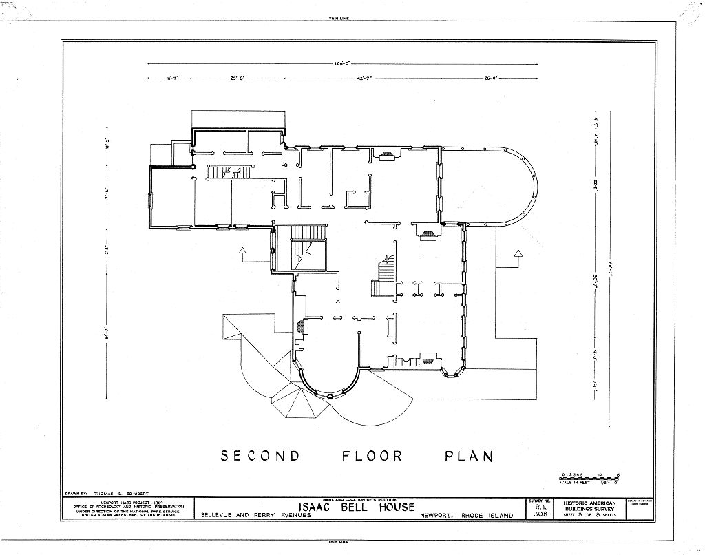

- **Style / era:** Shingle Style, house built 1881-1883 (McKim, Mead & White); HABS drawings 1969
- **Type:** single-family house (seaside cottage / villa) | **Country:** United States
- **Creator:** Historic American Buildings Survey; design architects McKim, Mead & White; delineator Thomas B. Schubert | **Source:** Library of Congress HABS
- **License:** [US Government Work](https://www.loc.gov/rr/print/res/114_habs.html)
- **Source page:** [link](https://www.loc.gov/item/ri0034/) | **Full-res file:** [link](https://tile.loc.gov/storage-services/service/pnp/habshaer/ri/ri0000/ri0034/sheet/00003v.jpg)

The Isaac Bell House in Newport, Rhode Island, designed by McKim, Mead & White in the early 1880s, is a landmark of the Shingle Style, and this HABS sheet records its second floor. The plan is a sprawling, irregular composition of bedrooms, dressing rooms, and baths organized off halls and landings, with a footprint that steps and jogs rather than resolving into a simple rectangle. Multiple staircases, including a prominent dogleg stair and a curved stair, weave through the interior, making the vertical circulation unusually rich for a single sheet.

The defining feature is the large round corner tower at the upper right, drawn with genuinely curved exterior walls that sweep through a full half-round and enclose a round room. A second curved, apsidal bay projects from the lower portion of the plan, and the porch below it is reached by a fan of curved steps splaying outward in an arc. These are not straight-edged approximations: they are true arcs and circular geometry, which the Phase-1 editor, whose walls are straight segments only, cannot represent.

This is the strongest curved-wall test case in the set. The round tower and the curved bay require arc wall segments and circular or apsidal room polygons, and the curved porch steps are part of an open, roofed porch space rather than an enclosed room. The straight-walled remainder of the plan, the named rooms, and the multiple stairs all fall within supported or roadmap territory, but the curved envelope and the covered porch push beyond it. The sheet also carries dimensioned overall runs and a graphic scale bar.

**Notable features**

- large round corner tower with genuinely curved exterior walls enclosing a round room
- second curved, apsidal bay projecting from the lower plan
- fan of curved porch steps splaying outward in an arc
- multiple staircases including a dogleg and a curved stair
- sprawling, irregular stepped-and-jogged Shingle Style footprint
- dimensioned overall runs and a graphic scale bar

**Supported today:** straight walls at right angles for the rectilinear remainder of the plan, rooms derived from walls; room naming and labels, linear point-to-point dimensions in imperial units, door and window plan symbols.

**On the roadmap:** multi-floor (second floor of a stacked house), straight-run stairs (dogleg stair runs).

**Not yet supported today (gaps). Draft feature requests:**

- [Curved and non-linear walls](../../../vernacular-planning/feature-curved-and-nonlinear-walls.md): the round corner tower and the apsidal bay have truly curved exterior walls and circular/apsidal room polygons that straight-segment Phase-1 walls cannot represent
- [Covered outdoor rooms (porches, verandas, breezeways)](../../../vernacular-planning/feature-covered-outdoor-rooms.md): the porch reached by the curved steps is a roofed but open space, not a fully wall-enclosed room

---

## 17. Eames House (Case Study House No. 8), Overall First and Second Floor Plans (HABS CA-2903, sheet 2)

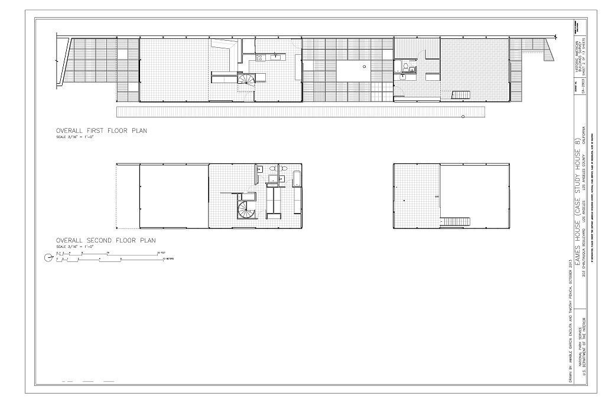

- **Style / era:** Mid-Century Modern, house built 1949 (Charles and Ray Eames); HABS drawings documented 2013
- **Type:** single-family house plus detached studio (two-building compound) | **Country:** United States
- **Creator:** Historic American Buildings Survey; design architects Charles Eames and Ray Eames; delineators Amabel Garcia Enguita and Timothy Fench | **Source:** Library of Congress HABS
- **License:** [US Government Work](https://www.loc.gov/rr/print/res/114_habs.html)
- **Source page:** [link](https://www.loc.gov/item/ca4169/) | **Full-res file:** [link](https://tile.loc.gov/storage-services/service/pnp/habshaer/ca/ca4100/ca4169/sheet/00002v.jpg)

The Eames House, Case Study House No. 8, was built in 1949 by Charles and Ray Eames in the Pacific Palisades and is an icon of Mid-Century Modern design. This HABS sheet lays out the overall first-floor plan along the top and the overall second-floor plan along the lower band, both at the same scale, and immediately makes the compound nature of the property legible: there are two separate buildings on the lot. The long rectilinear residence occupies the left and center of each plan, while a second, smaller detached structure, the studio, stands apart to the right with its own floor plans. A modular steel-frame grid is drawn across both buildings, with the bays and floor module ticked off as a fine grid that gives the drawing its characteristic rhythm.

The house itself is an open-plan steel-and-glass volume. The first floor reads as a long living space with a kitchen and service core toward the middle, a double-height living volume, and a spiral stair; the second floor stacks bedrooms and a bath over the service core, again threaded by the spiral stair, with much of the upper plan left open to the void below. The studio building repeats the same modular logic at a smaller size. Walls are straight and orthogonal throughout, and the rooms are simple rectangles set within the grid.

The plan's standout requirement is the two-building compound: a detached studio set apart from the main house, which the single-building model cannot hold as one project. The spiral stair is a second notable feature, since winding or spiral stair geometry sits beyond the straight-run stairs on the roadmap. The double-height living volume implies that the second-floor plan has an open well looking down into the first floor, a holed or open-to-below polygon. The modular grid, open planning, and stacked floors are otherwise well within supported or roadmap territory.

**Notable features**

- two-building compound: long rectilinear house plus a detached studio, each with its own plans
- overall first-floor and second-floor plans shown on one sheet at one scale
- modular steel-frame grid drawn across both buildings
- open-plan steel-and-glass living volume with a service core
- spiral stair threading both levels of the house
- double-height living volume with the second floor open to the void below
- graphic scale bar with imperial and metric divisions

**Supported today:** straight, orthogonal walls, rectangular rooms set within a modular grid, room naming and labels, door and window plan symbols, raster underlay with scale calibration.

**On the roadmap:** multi-floor (stacked first and second floors), furniture and fixture placement (kitchen and bath fixtures).

**Not yet supported today (gaps). Draft feature requests:**

- [Multi-building properties (multiple structures on one site)](../../../vernacular-planning/feature-multi-building-properties.md): the detached studio is a separate structure from the main house on the same property, which the single-building model cannot hold as one project
- [Vertical circulation beyond straight stairs (elevators, spiral stairs, ramps)](../../../vernacular-planning/feature-vertical-circulation-beyond-stairs.md): the house is served by a spiral stair, and spiral/winding stair geometry sits beyond the straight-run stairs on the roadmap
- [Courtyard and atrium spaces (open-air interior courts)](../../../vernacular-planning/feature-courtyard-and-atrium-spaces.md): the double-height living volume leaves the second-floor plan open to the floor below, an open-to-below well that reads as a holed room polygon

---

## 18. USDA Plan No. 7156 - 2-Bedroom Farmhouse with Carport (single-story plan + perspective)

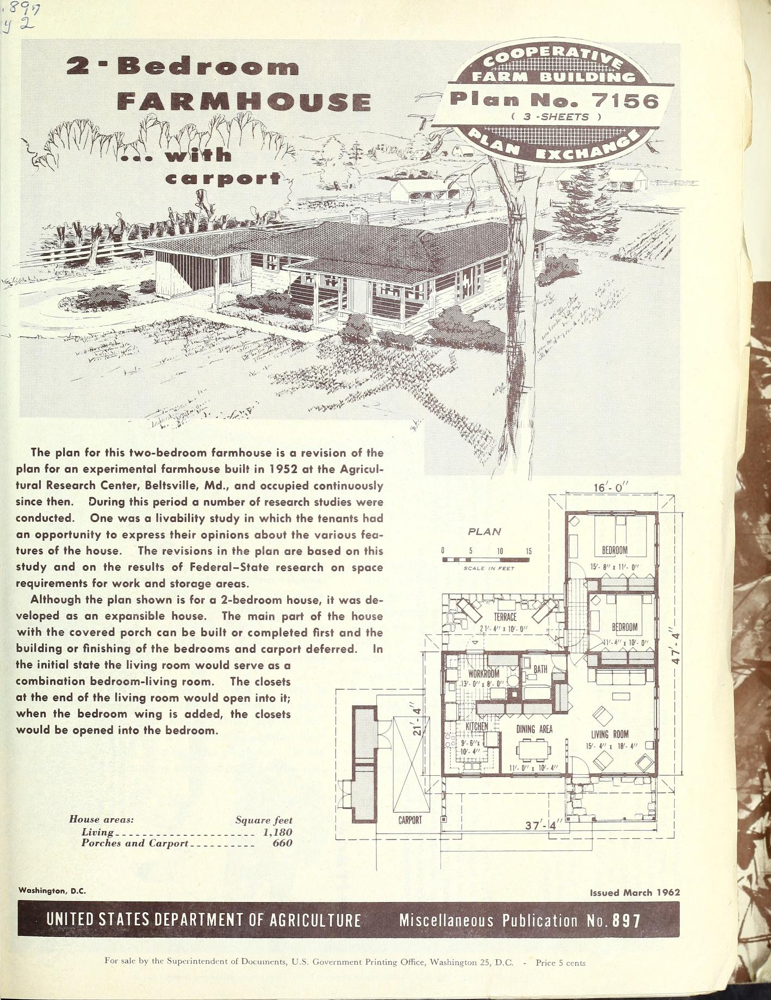

- **Style / era:** Mid-Century single-story ranch farmhouse, 1962 (design revised from a 1952 experimental house)
- **Type:** single-family house (one-story ranch with attached carport) | **Country:** United States
- **Creator:** U.S. Department of Agriculture, Agricultural Research Service (Cooperative Farm Building Plan Exchange) | **Source:** USDA / Internet Archive (contributing institution states item is not in copyright; US Government work)
- **License:** [US Government Work / Public Domain](https://archive.org/details/2bedroomfarmhous897unit)
- **Source page:** [link](https://archive.org/details/2bedroomfarmhous897unit) | **Full-res file:** [link](https://archive.org/download/2bedroomfarmhous897unit/page/n2_w1200.jpg)

USDA Plan No. 7156 is a two-bedroom single-story ranch farmhouse from the Cooperative Farm Building Plan Exchange, and this is the cover sheet of the three-sheet set. It pairs a perspective rendering of the low, broad-eaved house at the top with a single floor plan at the right, drawn at a small scale with its own graphic scale bar in feet. The house is a clean rectangle of about 1,180 square feet: a combination Living Room and Dining Area open to one another, a compact Kitchen and Workroom core, a Bath, and two Bedrooms strung along one side, with a Terrace opening off the living space. Furniture and fixtures are drawn in, including beds, sofas, a dining set, and kitchen equipment, and the rooms carry their individual dimensions (the larger bedroom at fifteen-eight by eleven, the living room at fifteen-four by eighteen-four, and so on).

The distinguishing element is the attached carport on the left end of the plan, a roofed but open space of about 660 square feet drawn as a rectangle crossed by an X to mark it as unenclosed covered parking. The accompanying text explains the house is expansible: the main part can be built first, with the bedrooms and carport deferred, and a bedroom later opened into what initially served as a combination bedroom-living room. The walls are straight and orthogonal and the rooms are plain rectangles, so the building geometry itself is conventional.

The carport is the clear gap here. It is a covered outdoor space that needs to be drawable as such, roofed but not wall-enclosed, rather than as a sealed room, and the Terrace is likewise an open outdoor space. The companion sheet 3 of the pamphlet carries a separate site plan showing the house, carport, drive, terrace, and plantings, but that site geometry lives on a different page and is not part of this cover sheet. The drawn furniture and fixtures fall under the roadmap, and the multi-floor and stair concerns do not arise on this single-story plan.

**Notable features**

- attached carport (about 660 sq ft) drawn as a roofed but open rectangle crossed by an X
- open combination Living Room and Dining Area with an adjoining Terrace
- two bedrooms, compact Kitchen/Workroom core, and Bath strung along the rectangle
- expansible plan: main part built first, bedrooms and carport deferred
- drawn-in furniture and fixtures (beds, sofas, dining set, kitchen equipment)
- per-room dimensions plus a graphic scale bar in feet
- perspective rendering paired with the plan on the cover sheet

**Supported today:** straight, orthogonal walls, rectangular rooms derived from walls, room naming and labels, linear point-to-point dimensions in imperial units, door and window plan symbols.

**On the roadmap:** furniture and fixture placement (beds, sofas, dining set, kitchen fixtures), site metadata (textual square-footage callouts).

**Not yet supported today (gaps). Draft feature requests:**

- [Covered outdoor rooms (porches, verandas, breezeways)](../../../vernacular-planning/feature-covered-outdoor-rooms.md): the attached carport is a roofed but unenclosed covered space (and the Terrace is an open outdoor space) that must be drawable without being a fully wall-enclosed room

---

## 19. USDA Plan No. 7201 - 4-Bedroom House with Split-Level Entry (lower & upper level plans)

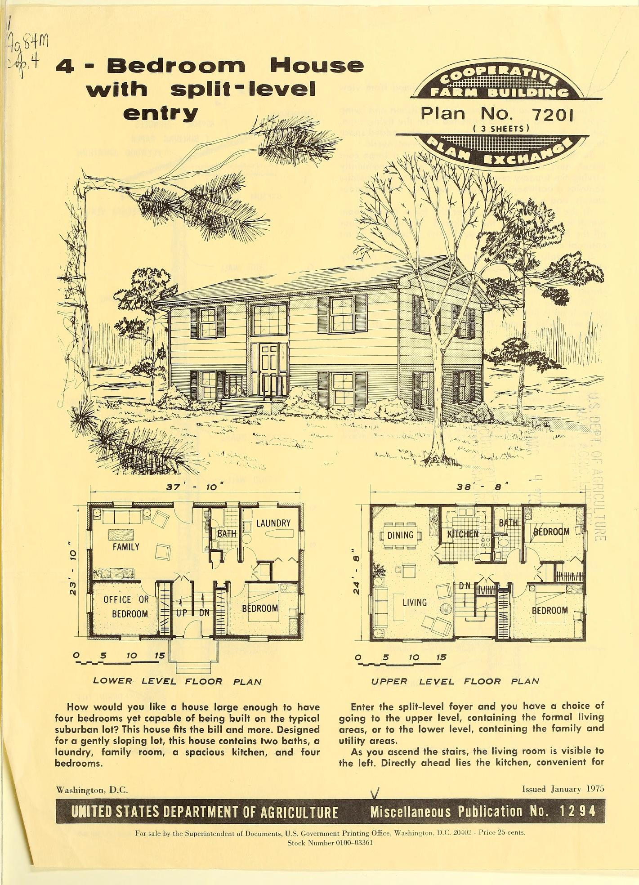

- **Style / era:** Mid-20th-century suburban split-level, 1975
- **Type:** single-family house (split-level) | **Country:** United States
- **Creator:** U.S. Department of Agriculture, Agricultural Research Service (Cooperative Farm Building Plan Exchange) | **Source:** USDA / Internet Archive (contributing institution states item is not in copyright; US Government work)
- **License:** [US Government Work / Public Domain](https://archive.org/details/4bedroomhousewit1294unit)
- **Source page:** [link](https://archive.org/details/4bedroomhousewit1294unit) | **Full-res file:** [link](https://archive.org/download/4bedroomhousewit1294unit/page/n2_w1200.jpg)

This is the cover sheet of a USDA Cooperative Farm Building Plan Exchange stock plan, "4-Bedroom House with Split-Level Entry," issued in 1975. The sheet pairs a pencil-rendered perspective of the two-story split-level house at the top with two small floor plans side by side at the bottom: a lower level floor plan on the left and an upper level floor plan on the right. Promotional body text between and below the plans describes a house "designed for a gently sloping lot," explicitly built around a split-level foyer from which you choose to go up to the living level or down to the lower level.

The lower level plan contains a family room, an office-or-bedroom, a full bath, a laundry, and two bedrooms, with "UP ON" stair callouts marking the connection to the entry foyer. The upper level plan holds the formal living areas: living, dining, and kitchen across the top, two more bedrooms, and a second bath, again tied to the foyer by a short flight of stairs. Each plan carries drawn overall and partial dimensions (roughly 37 by 16 feet on the lower level and 38 by 16 feet on the upper) and a small graphic scale bar beneath it.

The interesting test characteristic here is the split-level configuration itself: the two plans are not stacked full stories but staggered half-levels offset by a half flight at a shared central foyer. The rooms within each level are simple rectangles drawn with straight walls, conventional single-swing doors, and double-hung windows, so the individual room geometry is easy. What the drawing demands is a way to represent two partial levels at different elevations linked by an intermediate landing, rather than one floor at a single height or two cleanly stacked full stories.

It is also a compact multi-drawing sheet: a perspective plus two distinct floor plans plus marketing prose on a single page, with the kind of small graphic scale bars that a power user would expect to calibrate an underlay against.

**Notable features**

- two staggered half-level plans (lower + upper) on one sheet linked by a split-level foyer
- intermediate stair landing between the two half-levels rather than a full story offset
- four bedrooms split across the two levels plus family, living, dining, kitchen, two baths, laundry
- drawn overall and partial dimensions on each level (~37x16 ft lower, ~38x16 ft upper)
- small graphic scale bar under each plan for underlay calibration
- perspective sketch plus two distinct floor plans plus marketing prose on a single cover sheet
- rectangular rooms with single-swing doors and double-hung windows

**Supported today:** straight walls at right angles, rectangular rooms with room labels (family, living, dining, kitchen, bedroom, bath, laundry), single-swing interior doors, double-hung windows, linear point-to-point dimensions in imperial units, raster underlay with scale-bar calibration.

**On the roadmap:** floor management for multiple levels, straight-run stairs as a 2D symbol with floor-spanning topology.

**Not yet supported today (gaps). Draft feature requests:**

- [Split-levels, half-levels, and mezzanines](../../../vernacular-planning/feature-split-level-and-mezzanine.md): the house is two staggered half-levels offset by a half flight at a shared foyer, not one floor at a single height nor two cleanly stacked full stories; roadmap floor management covers discrete stacked levels but not partial/intermediate ones

---

## 20. 2 BHK Bungalow Floor Plan (color-rendered modern ground-floor plan)

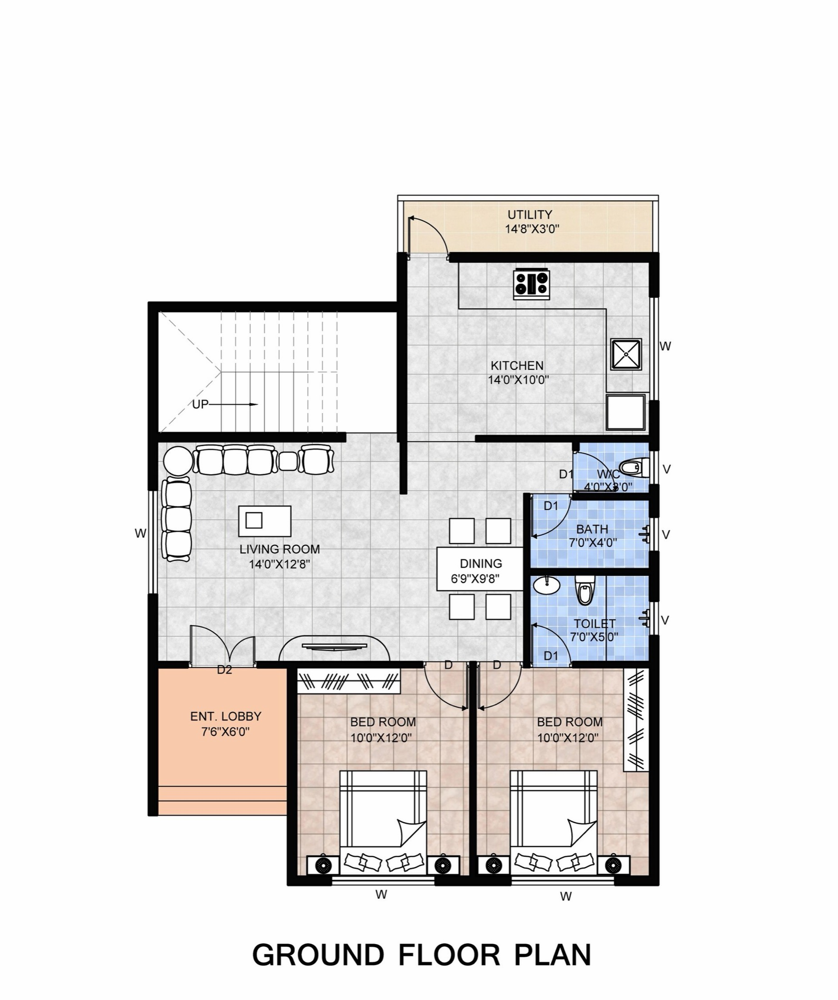

- **Style / era:** Contemporary open-plan residence, contemporary (uploaded 2020s)
- **Type:** single-family house (modern open-plan bungalow) | **Country:** India
- **Creator:** Wikimedia Commons user Jithurad4539 | **Source:** Wikimedia Commons uploader (Jithurad4539)
- **License:** [CC BY-SA 4.0](https://creativecommons.org/licenses/by-sa/4.0)
- **Source page:** [link](https://commons.wikimedia.org/wiki/File:2_bhk_Bungalow_floor_plan.jpg) | **Full-res file:** [link](https://commons.wikimedia.org/wiki/Special:FilePath/2%20bhk%20Bungalow%20floor%20plan.jpg?width=1600)

This is a clean, color-rendered ground floor plan of a contemporary two-bedroom (2 BHK) residence. The drawing fills its floor with light tile-texture hatching, tints wet rooms in blue and bedrooms in warm tan, and is captioned "GROUND FLOOR PLAN" along the bottom. It reads as a marketing-quality presentation plan rather than a working construction drawing.

The layout is built around an open living, dining, and kitchen core. A large living room with a sofa group occupies the lower left, flowing into a small central dining nook and an L-shaped kitchen with a range and two sinks along the top. A narrow utility runs across the top edge behind the kitchen, and a stack of small wet rooms (a WC, a bath, and a separate toilet) lines the right side. An entry lobby sits at the lower left corner, and two equal bedrooms with drawn bed and seating furniture occupy the bottom of the plan. Most rooms carry both a name and a dimension string (for example LIVING ROOM 14'0"x12'8", KITCHEN 14'0"x10'0", BED ROOM 10'0"x12'0"). A straight-run stair with an "UP" arrow climbs from the left side, implying a floor above.

The distinctive test feature is its use of schedule-style opening codes rather than drawn opening symbols alone. Doors are tagged D1 and D2 and windows are tagged W, with a third code V (likely ventilator) on the small high openings of the wet rooms. The opening codes imply a door and window schedule legend that keys size and type, which is a way of conveying opening identity indirectly instead of by symbol geometry alone. The plan also leans heavily on furniture and fixture symbols: sofas, beds, a dining table, a range, sinks, a tub, and water closets are all drawn in.

Geometrically this plan is straightforward and squarely within a conventional 2D editor's reach: orthogonal straight walls, rectangular rooms, ordinary single-swing doors and sliding or hung windows, and linear dimensions in imperial units. Its value as a test case lies in the open living/dining/kitchen zone, the color and material rendering, the schedule-coded openings, and the dense furniture symbology, all of which exercise labeling, fixtures, and opening metadata rather than unusual wall geometry.

**Notable features**

- open living/dining/kitchen core with an L-shaped kitchen
- schedule-style opening codes (D1, D2 for doors; W, V for windows/ventilators) implying a door/window schedule legend
- color-rendered presentation plan with tile-texture hatching and tinted wet rooms
- dense furniture and fixture symbols (sofas, beds, dining table, range, sinks, tub, water closets)
- named rooms with dimension strings (e.g. LIVING ROOM 14'0"x12'8")
- straight-run stair with UP arrow implying a floor above
- stack of small wet rooms (WC, bath, toilet) along one edge

**Supported today:** orthogonal straight walls, rectangular rooms with names and labels, thickness-aware clear floor area from drawn room dimensions, single-swing doors and sliding/hung windows with placement and flip, linear point-to-point dimensions in imperial units, click selection and clipboard for repeated identical bedrooms.

**On the roadmap:** furniture and fixture placement (beds, sofas, range, sinks, tub, water closets), straight-run stairs as a 2D symbol, floor management for the implied upper floor, paint/finish model and palettes for the color-coded rooms.

**Fully representable today.** A baseline case with no gaps.

---

## 21. 30 x 35 ft Home Plan (CAD line drawing with full dimension chains)

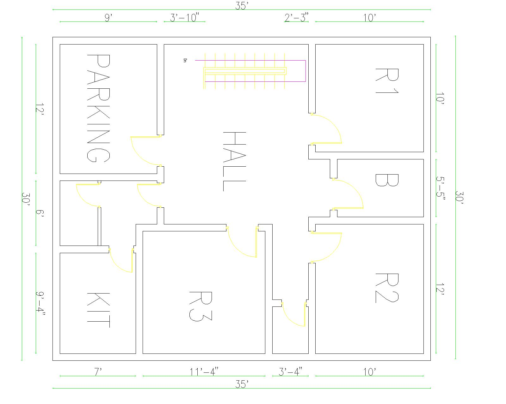

- **Style / era:** Contemporary compact house, contemporary (uploaded 2020s)
- **Type:** single-family house (modern compact plan) | **Country:** India
- **Creator:** Wikimedia Commons user Erayushtomar (Ayush Tomar) | **Source:** Wikimedia Commons uploader (Erayushtomar); CC0 dedication
- **License:** [CC0 1.0](http://creativecommons.org/publicdomain/zero/1.0/deed.en)
- **Source page:** [link](https://commons.wikimedia.org/wiki/File:30BY35_home_plan_by_ER._AYUSH_TOMAR_9997233546.jpg) | **Full-res file:** [link](https://commons.wikimedia.org/wiki/Special:FilePath/30BY35%20home%20plan%20by%20ER.%20AYUSH%20TOMAR%209997233546.jpg?width=1600)

This is a plain CAD line export of a compact single-story house, 35 feet wide by 30 feet deep, drawn with no color fills and no furniture. Walls are solid black lines, door leaves and swing arcs are drawn in yellow, the interior stair is picked out in yellow and magenta, and every dimension is carried on green dimension strings outside the building. It has the unmistakable look of a vector drawing exported flat to a raster, which makes a useful contrast to the rendered, color-coded presentation plans elsewhere in the corpus.

The layout is a simple grid of rooms around a central HALL. A covered PARKING bay occupies the upper left. Below it sit a kitchen (KIT) and a third room (R3) along the bottom left. The central HALL runs up the middle and holds the stair. The right side is divided into two larger rooms (R1 over R2) with a small bathroom (B) tucked between them. Doors with clear swing arcs connect the hall to each room and the parking to the service rooms. Rooms are identified only by terse codes (R1, R2, R3, B, KIT, HALL, PARKING) with no descriptive names or in-room dimensions.

The standout test feature is the dimensioning. The plan carries full running dimension chains on all four sides: an overall 35-foot figure on top and bottom and an overall 30-foot figure on both ends, each broken into a chain of sub-dimensions (9', 3'-10", 2'-3", 10' across the top; 7', 11'-4", 3'-4", 10' across the bottom; 10', 5'-5", 12' down one side; 12', 6', 9'-4" down the other). This is exactly the kind of explicit running dimension chain a power user expects to read off and reproduce.

Geometrically the building is entirely orthogonal: straight walls at right angles, rectangular rooms, and conventional single-swing doors shown with their swing arcs. Apart from the chained dimensions and the straight-run stair, the plan is squarely representable in a conventional 2D editor. The PARKING bay is drawn as a fully enclosed room here rather than an open carport, so it reads as an ordinary room rather than a covered outdoor space.

**Notable features**

- flat CAD vector look: black walls, yellow door swing arcs, green dimension strings, no fills
- full running dimension chains on all four sides (overall 35'x30' broken into sub-dimensions)
- central HALL with an interior stair drawn in yellow/magenta
- rooms identified only by terse codes (R1, R2, R3, B, KIT, HALL, PARKING), no names or in-room dimensions
- covered PARKING bay drawn as a fully enclosed room
- single-swing doors with clearly drawn swing arcs
- entirely orthogonal grid of rectangular rooms

**Supported today:** straight walls at right angles with wall thickness, rectangular rooms, single-swing doors with swing arcs, placement and flip, linear point-to-point dimensions in imperial units, snapping to an orthogonal grid.

**On the roadmap:** straight-run stairs as a 2D symbol.

**Fully representable today.** A baseline case with no gaps.

---

## 22. Richard Buckminster Fuller & Anne Hewlett Fuller Dome Home (measured drawing sheet 1)

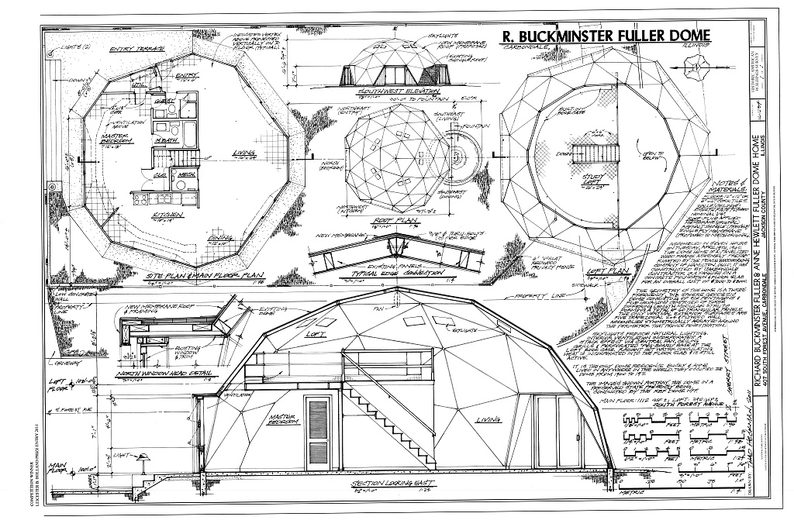

- **Style / era:** Geodesic dome (Buckminster Fuller paperboard/plydome), built 1960; HABS documentation drawing
- **Type:** single-family house (geodesic dome) | **Country:** United States
- **Creator:** Historic American Buildings Survey (HABS IL-1234), delineated by NPS/HABS | **Source:** Library of Congress HABS (Prints & Photographs Division)
- **License:** [US Government Work / Public Domain](https://www.loc.gov/rr/print/res/114_habs.html)
- **Source page:** [link](https://www.loc.gov/item/il0995/) | **Full-res file:** [link](https://tile.loc.gov/storage-services/service/pnp/habshaer/il/il0900/il0995/sheet/00001v.jpg)

This is the single measured-drawing sheet documenting R. Buckminster Fuller's own geodesic dome home, built in 1960 in Carbondale, Illinois, and surveyed for the Historic American Buildings Survey. The sheet is a dense composite: a combined site plan and main floor plan in the upper left, a triangulated roof plan and a loft plan across the top, a southwest elevation, several construction details, and a large section "looking east" running along the bottom. The dome itself is the defining feature: a hemispherical geodesic shell of triangulated struts that forms the entire building envelope, with no conventional vertical exterior walls.

The main floor plan shows how a rectilinear interior is fitted inside that round, faceted shell. Reading the plan, an entry terrace sits outside at the top, the entry leads in past a guest room and bath, a master bedroom occupies the upper left, a closet and mechanical room sit at the center, a kitchen runs along the bottom, the living area opens to the right, and a dining area projects at the lower edge. The interior partitions are mostly straight and orthogonal, but the rooms at the perimeter are clipped and angled to follow the many-sided dome wall, and a ventilation alcove is carved into the curved edge. The section and elevation make the three-dimensional reality plain: the living space sits under the dome's curve with a loft reached by a stair tucked inside the shell.

The reason this is a flagship test case is the envelope. The building boundary is not a set of straight vertical wall segments but a curved, geodesic dome shell, so the exterior cannot be drawn as ordinary thickness-bearing walls at all. The interior rooms are individually representable as straight-sided polygons, but the surrounding dome and the way perimeter rooms meet its faceted curve have no equivalent in a straight-wall model. The drawing also includes the loft as a partial upper level inside the same dome volume, a roof plan that is pure geodesic geometry, and an entry terrace that is a roofed-but-open outdoor space rather than an enclosed room.

As a documentation artifact it is also a multi-drawing HABS sheet at heavy density: plan, roof plan, loft plan, elevation, section, and details together, with a north arrow, scale bars, and a property line shown on the site plan. It is an excellent stress test for a building whose primary geometry is a curved shell rather than a wall layout.

**Notable features**

- geodesic dome shell as the entire building envelope, with no conventional vertical exterior walls
- rectilinear interior fitted inside a round, many-sided dome wall (rooms clipped/angled at the perimeter)
- loft as a partial upper level inside the same dome volume
- triangulated roof plan that is pure geodesic geometry
- entry terrace as a roofed-but-open outdoor space rather than an enclosed room
- ventilation alcove carved into the curved edge
- dense composite HABS sheet: plan, roof plan, loft plan, elevation, section, details
- site plan with property line, north arrow, and scale bars

**Supported today:** straight interior partition walls, rooms with names (entry, guest, bath, master bedroom, kitchen, living, dining), custom-polygon room override for perimeter rooms clipped to straight facets, raster underlay with scale-bar calibration.

**On the roadmap:** floor management for the loft as a partial upper level, straight-run stairs to the loft, site metadata for the surveyed property.

**Not yet supported today (gaps). Draft feature requests:**

- [Dome and shell structures](../../../vernacular-planning/feature-dome-and-shell-structures.md): the building envelope is a geodesic dome shell with no vertical wall layout; a straight thickness-bearing wall model cannot represent the curved triangulated shell that defines the entire perimeter and roof
- [Roof and sloped-ceiling geometry](../../../vernacular-planning/feature-roof-and-sloped-ceiling-geometry.md): the geodesic roof and the curved shell over the living/loft volume are roof/sloped-ceiling geometry, not a flat per-room ceiling height
- [Covered outdoor rooms (porches, verandas, breezeways)](../../../vernacular-planning/feature-covered-outdoor-rooms.md): the entry terrace is a roofed-but-open outdoor space that must be drawable as a space without being a fully wall-enclosed room

---

## 23. The Octagon House, Washington DC (HABS DC-25, first floor plan, sheet 3)

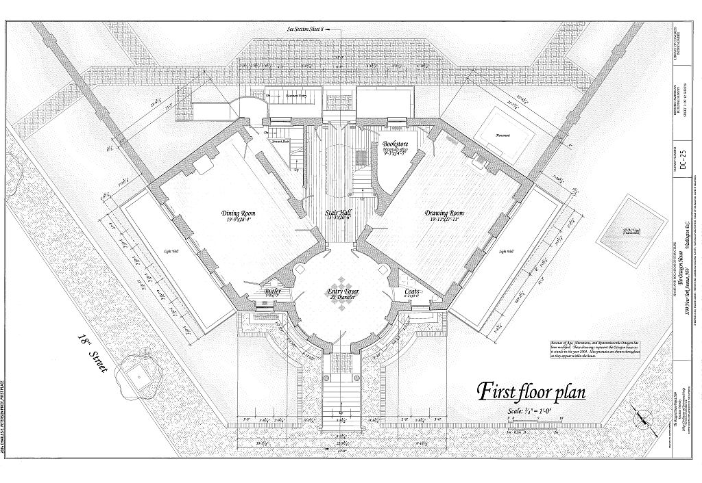

- **Style / era:** Federal (octagon-form town house, William Thornton, 1799-1801), 1799-1801; HABS drawings ca. 2004
- **Type:** single-family house (octagonal / curved-wall mansion) | **Country:** United States
- **Creator:** Historic American Buildings Survey (HABS DC-25); original architect William Thornton | **Source:** Library of Congress HABS (Prints & Photographs Division)
- **License:** [US Government Work / Public Domain](https://www.loc.gov/rr/print/res/114_habs.html)
- **Source page:** [link](https://www.loc.gov/item/dc0195/) | **Full-res file:** [link](https://tile.loc.gov/storage-services/service/pnp/habshaer/dc/dc0100/dc0195/sheet/00003v.jpg)

This is the first floor plan of the Octagon House in Washington, D.C., William Thornton's Federal-period town house of 1799 to 1801, as recorded by the Historic American Buildings Survey. Despite its name the building is not actually an eight-sided octagon. Its plan is a clever response to an acute corner lot at 18th Street and New York Avenue: a round entry foyer sits at the apex of the corner, and two long rectangular wings splay back from it at an oblique angle to follow the two streets, giving the whole a wide, shallow V or bow-tie footprint wrapped around a curved nose. The sheet is titled "First floor plan" at a scale of one eighth inch to the foot, set within a rendered site showing the surrounding walks, plantings, and street edges, with a north arrow and a graphic scale bar at the lower right.

At the apex is the circular Entry Foyer, called out as thirty feet in diameter, fronted by a curved, semicircular bowed wall facing the street corner. Behind and around it the plan organizes a Stair Hall with a curving stair on the centerline, a Bookstore, and two small service rooms (Butler and Coats) flanking the foyer. The two splayed wings each hold a major room: a Dining Room in one wing and a Drawing Room in the other, both drawn as parallelograms set at the oblique splay angle rather than as orthogonal rectangles. Light wells and service stairs sit between the wings and the foyer block. Every room is dimensioned (the Dining Room at 19'-9"x28'-4", the Drawing Room at 19'-11"x27'-11").

This is an outstanding curved-and-angled-wall test case for two distinct reasons. First, the entry foyer is a genuinely round room with a truly curved exterior wall, which a straight-segment wall model cannot reproduce except by faceting. Second, the two wings meet the foyer block at an oblique, non-orthogonal angle, so the major rooms are angled parallelograms and the wall junctions are off the right angle. The angled rooms themselves are straight-sided and could be drawn as custom polygons, but the curved foyer wall genuinely exceeds a straight-wall model, and the whole composition stresses non-orthogonal wall topology.

The plan also reads as a richly annotated HABS drawing: it is set on its real corner site with surrounding landscape, carries the north arrow and scale bar expected of a survey sheet, and a companion basement plan (not shown here) repeats the same splayed-and-curved geometry below.

**Notable features**

- not actually eight-sided: a round entry foyer at a corner-lot apex with two wings splayed at an oblique angle (a bow-tie/wide-V footprint)
- circular Entry Foyer, 30 ft diameter, fronted by a curved semicircular bowed exterior wall
- major rooms (Dining Room, Drawing Room) drawn as angled parallelograms at the oblique splay angle, not orthogonal
- curving stair on the centerline in a central Stair Hall
- small service rooms (Butler, Coats) and a Bookstore flanking the foyer
- fully dimensioned rooms (Dining 19'-9"x28'-4", Drawing 19'-11"x27'-11")
- rendered corner site at 18th & New York Ave with walks, plantings, and street edges
- HABS sheet with north arrow and graphic scale bar

**Supported today:** straight walls at oblique (non-orthogonal) angles for the splayed wings, custom-polygon room override for the angled parallelogram wings and service rooms, rooms with names and labels (Dining Room, Drawing Room, Stair Hall, Butler, Coats), linear point-to-point dimensions in imperial units, raster underlay with scale-bar calibration.

**On the roadmap:** curving stair geometry in the stair hall (named-but-deferred for spiral/winding stairs), site metadata for the corner lot.

**Not yet supported today (gaps). Draft feature requests:**

- [Curved and non-linear walls](../../../vernacular-planning/feature-curved-and-nonlinear-walls.md): the 30 ft round entry foyer has a truly curved, semicircular exterior wall that a straight-segment wall model can only approximate by faceting; the foyer is a genuine round room
- [Site and landscape plans (lot, grounds, outdoor geometry)](../../../vernacular-planning/feature-site-and-landscape-plan.md): the sheet draws the building's placement on its real corner lot with walks, plantings, and street edges as site geometry, which is not representable (only textual site metadata is on the roadmap)
- [Plan annotations: north arrow and scale bar](../../../vernacular-planning/feature-plan-annotations-north-arrow-scale-bar.md): the drawing carries a north arrow and a graphic scale bar as plan annotations

---

## 24. Octagon House, Watertown, Wisconsin - floor plans (HABS)

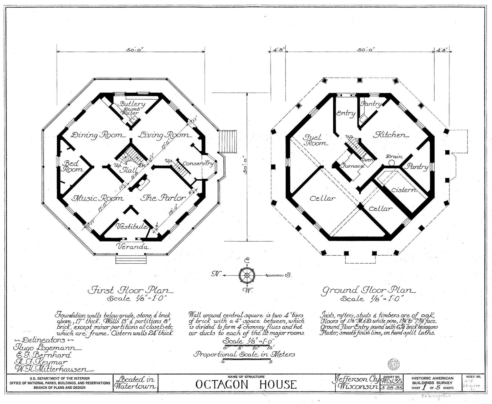

- **Style / era:** Octagon house (Fowler movement), house c.1854 (drawing 1935)
- **Type:** single-family house | **Country:** United States
- **Creator:** Historic American Buildings Survey (HABS WIS-28) | **Source:** Library of Congress, Prints & Photographs Division (HABS); via Wikimedia Commons
- **License:** [US Government Work](https://commons.wikimedia.org/wiki/File:Watertown_Octagon_House-plans.png)
- **Source page:** [link](https://commons.wikimedia.org/wiki/File:Watertown_Octagon_House-plans.png) | **Full-res file:** [link](https://commons.wikimedia.org/wiki/Special:FilePath/Watertown_Octagon_House-plans.png?width=1600)

This is a Historic American Buildings Survey measured-drawing sheet for the Octagon House in Watertown, Wisconsin, a roughly 1854 house built in the eight-sided form popularized by the Fowler octagon movement. Unlike the misnamed Octagon House in Washington, this one truly is an octagon: a regular eight-sided envelope of eight straight exterior walls. The sheet carries two plans side by side, a First Floor Plan on the left and a Ground (lower) Floor Plan on the right, each at one eighth inch to the foot, with a compass rose north indicator, an imperial scale, and a proportional scale in meters beneath them, plus a delineators' block and a notes panel describing the stone-and-brick foundation and the chimney flues.

The first floor is organized as rooms ringing a central stair hall. Around the perimeter sit the Dining Room, Living Room, Bed Room, Music Room, and The Parlor, with a small Conservatory, a Butlery served by a dumb waiter, a Vestibule at the entrance, and a Veranda wrapping the lower sides. Because the building is an octagon, the four corner rooms are five-sided shapes with one wall cut at forty-five degrees to follow the diagonal faces, while the central hall and the small service spaces become wedge and trapezoidal shapes packed around the staircase. The ground floor mirrors the geometry below with a Kitchen, Pantry, Sitting Room, Cellars, and a furnace room. Room dimensions are written into several spaces (the hall at 9'-10", the parlor wall at 18'-0", and so on).

The interesting geometry here is the radial, eight-sided organization: rooms fan out from a central core to fill an octagonal shell, so almost every room is a non-rectangular straight-sided polygon and the corner rooms in particular carry a diagonal wall. All of these shapes are straight-edged, so each room and the octagonal envelope itself can be drawn with straight walls and the custom-polygon room override, which makes this a strong but ultimately representable stress test for non-rectangular, angled-wall layouts rather than a true geometry gap.

What does push past current and roadmap capability is the vertical circulation and the outdoor space. The Butlery is served by a labeled dumb waiter, a small vertical lift that is neither a stair nor any roadmap circulation element. The Veranda wrapping the lower faces of the octagon is a roofed-but-open porch, a covered outdoor space rather than an enclosed room. The sheet is also a fully annotated survey drawing with a compass rose and dual imperial and metric scale bars, the kind of orientation and graphic-scale annotations a survey plan is expected to carry.

**Notable features**

- a true eight-sided octagon envelope of eight straight exterior walls
- rooms ringing a central stair hall in a radial, eight-sided organization
- four corner rooms are five-sided shapes with one wall cut at 45 degrees on the diagonal faces
- central hall and service spaces become wedge and trapezoidal shapes around the stair
- Butlery served by a labeled dumb waiter (a small vertical lift)
- Veranda wrapping the lower faces as a roofed-but-open porch
- two plans on one sheet (first floor + ground/lower floor) with matching octagon geometry
- compass rose north indicator plus dual imperial and metric (proportional) scale bars

**Supported today:** straight exterior walls at 45-degree and right angles forming the octagon, custom-polygon room override for the pentagonal corner rooms and wedge/trapezoidal core spaces, rooms with names (Dining Room, Living Room, Parlor, Music Room, Bed Room, Kitchen, Pantry, Cellar), straight-sided octagonal-with-straight-sides rooms (explicitly representable), linear point-to-point dimensions in imperial units, raster underlay with scale-bar calibration.

**On the roadmap:** floor management for the two stacked floors (first floor over ground/cellar level), straight-run or winding stairs in the central hall, era registry/tagging for the Fowler octagon-movement style.

**Not yet supported today (gaps). Draft feature requests:**

- [Vertical circulation beyond straight stairs (elevators, spiral stairs, ramps)](../../../vernacular-planning/feature-vertical-circulation-beyond-stairs.md): the Butlery is served by a labeled dumb waiter, a small vertical lift that is neither a stair nor any roadmap circulation element
- [Covered outdoor rooms (porches, verandas, breezeways)](../../../vernacular-planning/feature-covered-outdoor-rooms.md): the Veranda wraps the lower faces of the octagon as a roofed-but-open porch that must be drawable as a space without being a fully wall-enclosed room
- [Plan annotations: north arrow and scale bar](../../../vernacular-planning/feature-plan-annotations-north-arrow-scale-bar.md): the survey sheet carries a compass-rose north indicator and dual imperial/metric graphic scale bars as plan annotations

---

## 25. Villa Almerico Capra (La Rotonda) plan, from I quattro libri dell'architettura

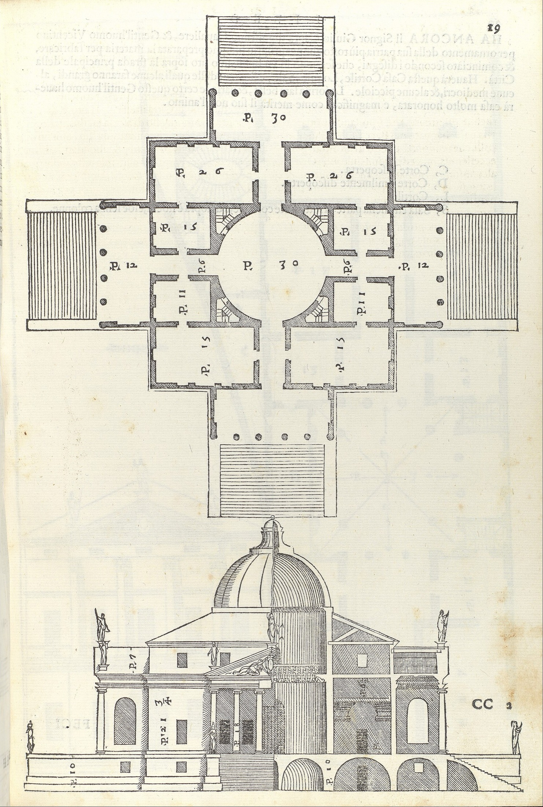

- **Style / era:** Renaissance / Palladian, 1570
- **Type:** villa | **Country:** Italy
- **Creator:** Andrea Palladio (delineator); plate from I quattro libri dell'architettura | **Source:** Metropolitan Museum of Art (Open Access); via Wikimedia Commons
- **License:** [CC0 1.0](http://creativecommons.org/publicdomain/zero/1.0/deed.en)
- **Source page:** [link](<https://commons.wikimedia.org/wiki/File:Villa_Almerico_(Villa_Rotunda),_from_I_quattro_libri_dell%27architettura_di_Andrea_Palladio_(Book_2,_page_19)_MET_DP109542.jpg>) | **Full-res file:** [link](<https://commons.wikimedia.org/wiki/Special:FilePath/Villa_Almerico_(Villa_Rotunda),_from_I_quattro_libri_dell%27architettura_di_Andrea_Palladio_(Book_2,_page_19)_MET_DP109542.jpg?width=1600>)

Andrea Palladio's plate for the Villa Almerico Capra, universally known as La Rotonda, is one of the most famous diagrams in Western architecture. The sheet combines two drawings: the floor plan in the upper portion and a matching elevation-and-section below, showing the celebrated central dome. The plan alone is the floor-plan of interest here, and it is a near-perfect exercise in symmetry. A square main block is organized around a great circular central hall (the rotunda), and four identical projecting temple-front porticoes, each fronted by a flight of steps, push out on all four sides. The whole composition is symmetric across two axes and rotationally symmetric in quarters.

The interior rooms carry Palladio's terse dimensional notation rather than names: the porches and major rooms are tagged "P. 30," "P. 26," "P. 15," and "P. 12" (measurements in Vicentine feet), arranged in mirror-image pairs around the round hall. Apart from that round central space, the surrounding rooms are conventional rectangles with straight walls, which makes the round hall the single defining geometric challenge of the plan.

This plate is a strong test case for two things Vernacular handles partially or not at all. The four projecting porticoes are roofed, columned, open-air spaces (loggias), not enclosed rooms, and the central rotunda is a true round room whose walls are curved arcs rather than straight segments. The straight-walled perimeter rooms and the inscribed-dimension labels are otherwise well within what the current editor can represent, so the value of this example is concentrated in the curved central hall and the open porticoes.

**Notable features**

- round central hall (rotunda) inscribed in a square block
- four identical projecting temple-front porticoes with steps
- two-axis and four-fold rotational symmetry
- rooms tagged with inscribed dimension figures (P. 30, P. 26, P. 15, P. 12)
- combined plan plus elevation/section on one Renaissance plate
- straight-walled perimeter rooms around a single curved space

**Supported today:** straight walls at angles forming rectangular perimeter rooms, symmetric room layout with paired mirror-image rooms, linear inscribed dimension figures on rooms, raster underlay with scale calibration to trace the historic plate.

**On the roadmap:** site/textual metadata for a named historic villa, era registry tagging (Renaissance / Palladian).

**Not yet supported today (gaps). Draft feature requests:**

- [Curved and non-linear walls](../../../vernacular-planning/feature-curved-and-nonlinear-walls.md): the great central rotunda is a true round room bounded by curved arc walls, not straight segments
- [Covered outdoor rooms (porches, verandas, breezeways)](../../../vernacular-planning/feature-covered-outdoor-rooms.md): the four projecting temple-front porticoes are roofed, columned, open-air loggias rather than fully wall-enclosed rooms

---

## 26. Floor plan of Chiswick House with additional wings

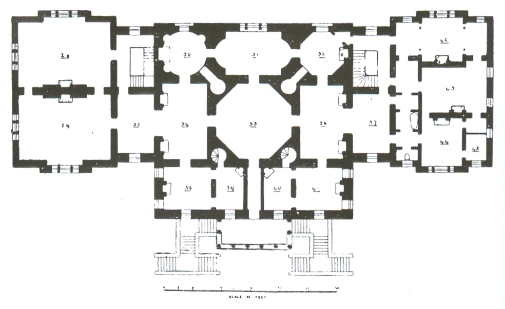

- **Style / era:** English Palladian (Neo-Palladian), house c.1729 (diagram drawn 2008)
- **Type:** villa | **Country:** United Kingdom
- **Creator:** Wikimedia user Chivalrick1 | **Source:** Wikimedia Commons uploader (own work)
- **License:** [CC BY-SA 3.0](https://creativecommons.org/licenses/by-sa/3.0)
- **Source page:** [link](https://commons.wikimedia.org/wiki/File:Floor_paln_of_Chiswick_House_with_additional_wings.jpg) | **Full-res file:** [link](https://commons.wikimedia.org/wiki/Special:FilePath/Floor_paln_of_Chiswick_House_with_additional_wings.jpg?width=1600)

This is a measured diagram redraw of Chiswick House, Lord Burlington's English Neo-Palladian villa, here shown with its flanking wings. The plan is rendered in heavy black poché, so the masonry walls read as solid filled shapes and the rooms as the white voids between them. The composition is strongly symmetric about a central spine: a tall central block holding the principal state rooms is bracketed by two large rectangular pavilion-wings, one at each end of the drawing.

The interest of the plan is the variety of room shapes packed into the central block. Rather than a grid of rectangles, Burlington assembled a suite of geometrically distinct chambers: a domed central saloon, apsidal rooms with curved (semicircular) ends, octagonal and other polygonal rooms, and small circular closets. Two of the rooms clearly contain spiral staircases, drawn as tight curved coils. A graphic scale bar labeled "SCALE OF FEET" runs along the bottom edge, and the rooms are keyed by small numbers rather than carrying drawn dimensions, so identity and size are meant to be read from a separate legend. A symmetrical double exterior stair and terrace projects from the front of the central block.

For Vernacular this plan is a rich mixed case. The straight-sided polygonal rooms (octagons and the like) are representable today via custom room polygons, but the apsidal curved-end rooms, the round closets, and the spiral stairs all require curved geometry the Phase-1 editor does not provide. The numbered-room key instead of inscribed dimensions, and the graphic scale bar, are further capabilities not on the current roadmap. The two flanking wings read as parts of one continuous structure rather than separate buildings, so the main gaps here are curved walls, the room legend, and the scale-bar annotation.

**Notable features**

- central domed saloon flanked by a suite of distinct room shapes
- apsidal (curved-end) rooms and small circular closets
- octagonal and other straight-sided polygonal rooms
- two spiral staircases drawn as curved coils
- heavy black poché walls (solid-filled masonry)
- numbered-room key instead of inscribed dimensions
- graphic scale bar (SCALE OF FEET)
- symmetric layout with two flanking pavilion-wings and an exterior double stair

**Supported today:** straight-sided polygonal rooms (octagonal and angular) via custom room polygons, symmetric room arrangement with mirrored pairs, straight walls at varied angles forming the wing blocks, raster underlay tracing of a measured diagram.

**On the roadmap:** wall construction profiles / poché for thick masonry walls, straight-run and (eventually) stair topology for the exterior double stair, era registry tagging (English Palladian).

**Not yet supported today (gaps). Draft feature requests:**

- [Curved and non-linear walls](../../../vernacular-planning/feature-curved-and-nonlinear-walls.md): apsidal curved-end rooms, round closets, and spiral-stair enclosures need true arc walls, not straight segments
- [Room schedules and legends (indirect room sizing)](../../../vernacular-planning/feature-room-schedule-and-legend.md): rooms are identified by small numbers keyed to a separate legend rather than by drawn dimensions
- [Plan annotations: north arrow and scale bar](../../../vernacular-planning/feature-plan-annotations-north-arrow-scale-bar.md): the plan carries a graphic SCALE OF FEET bar as a drawn annotation

---

## 27. Plan of the Château de Pierrefonds

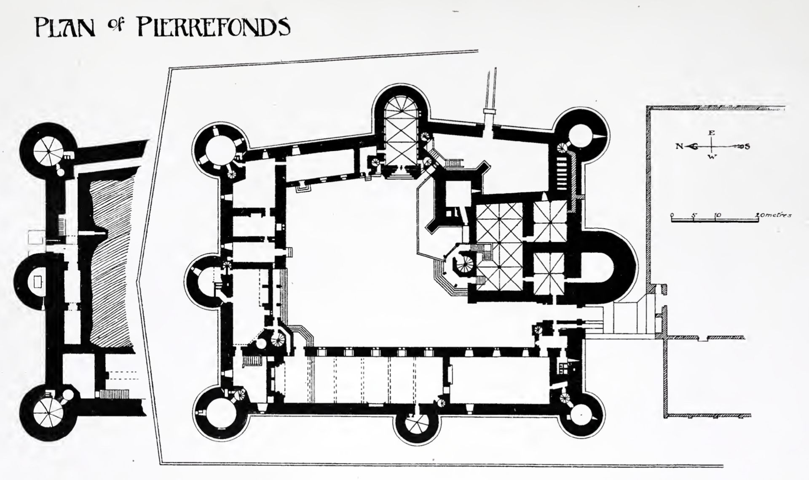

- **Style / era:** Medieval / Viollet-le-Duc restoration, published 1898/1899 (restoration of a 14th-15th c. castle)
- **Type:** castle | **Country:** France
- **Creator:** After Eugene Viollet-le-Duc; delineator not credited | **Source:** Public-domain plate from The Architectural Review vol. 5 (1898/9); via Wikimedia Commons
- **License:** [Public Domain](https://commons.wikimedia.org/wiki/File:Ch%C3%A2teau_de_Pierrefonds_-_plan.png)
- **Source page:** [link](https://commons.wikimedia.org/wiki/File:Ch%C3%A2teau_de_Pierrefonds_-_plan.png) | **Full-res file:** [link](https://commons.wikimedia.org/wiki/Special:FilePath/Ch%C3%A2teau_de_Pierrefonds_-_plan.png?width=1600)

This is a plan of the Chateau de Pierrefonds, a medieval French fortress as restored by Viollet-le-Duc, published as a plate in an architectural review. It is about as far from a modern rectangular house plan as a building gets. The main castle is an irregular polygon of thick curtain walls, drawn in dense black poché, with massive round towers and turrets clustered at the corners and along the walls. Several of those towers contain spiral stairs, drawn as curved coils inside the solid circles. The walls run at many non-orthogonal angles, and curved wall segments connect the round towers to the straight ranges.

Inside the enceinte sits a large open inner courtyard (the castle ward), bounded by ranges of rooms, a great hall, and a chapel with vaulted bays drawn as cross-hatched compartments. To the left of the main castle, across a hatched ditch or moat, stands a separate detached outwork or keep with its own four round corner towers, a clearly distinct structure on the same fortified site. The whole composition is wrapped by an angled outer boundary line, the edge of the fortified site or glacis. The sheet also carries a compass rose (north arrow) at upper right and a graphic scale bar in metres.

For Vernacular almost every primitive here is challenging. The defining feature is curved geometry: the round towers and turrets are true circular structures, and the connecting walls bow and angle rather than running straight. The plan is also a multi-structure site (main castle plus detached outwork) inside a drawn property boundary, with a courtyard ward and a north arrow and scale bar as annotations. Thick masonry poché and spiral stairs are roadmap-tracked, but the curved walls, the multi-building site, the courtyard, and the orientation annotations are genuine gaps that make this an unusually demanding case.

**Notable features**

- irregular polygonal curtain wall with non-orthogonal angled segments
- multiple large round towers and turrets, some with spiral stairs
- curved wall segments linking round towers to straight ranges
- large open inner courtyard (castle ward)
- great hall and chapel with vaulted, cross-hatched bays
- detached outwork/keep across a moat as a separate structure
- angled outer site/glacis boundary enclosing the fortress
- compass rose (north arrow) and metric scale bar annotations
- very thick masonry walls in heavy black poché

**Supported today:** straight wall segments at many non-orthogonal angles, thickness-aware walls and wall junctions for the straight ranges, raster underlay with scale calibration to trace the historic plate.

**On the roadmap:** wall construction profiles / poché for thick masonry curtain walls, spiral/winding stair geometry inside the towers, site/textual metadata for a named historic castle, era registry tagging (medieval / Viollet-le-Duc restoration).

**Not yet supported today (gaps). Draft feature requests:**

- [Curved and non-linear walls](../../../vernacular-planning/feature-curved-and-nonlinear-walls.md): the round towers and turrets are true circular structures and the connecting curtain walls bow and curve rather than running straight
- [Multi-building properties (multiple structures on one site)](../../../vernacular-planning/feature-multi-building-properties.md): a detached outwork/keep with its own corner towers sits apart from the main castle across a moat on the same site
- [Site and landscape plans (lot, grounds, outdoor geometry)](../../../vernacular-planning/feature-site-and-landscape-plan.md): the plan draws the fortified site boundary (glacis/enclosure line) and the moat around the structures, not just the building footprint
- [Courtyard and atrium spaces (open-air interior courts)](../../../vernacular-planning/feature-courtyard-and-atrium-spaces.md): the building wraps around a large open inner courtyard (castle ward) enclosed by the ranges
- [Plan annotations: north arrow and scale bar](../../../vernacular-planning/feature-plan-annotations-north-arrow-scale-bar.md): the plate carries a compass rose north arrow and a graphic metric scale bar as drawn annotations

---

## 28. Floor plan of the House of the Vettii, Pompeii (VI 15,1)

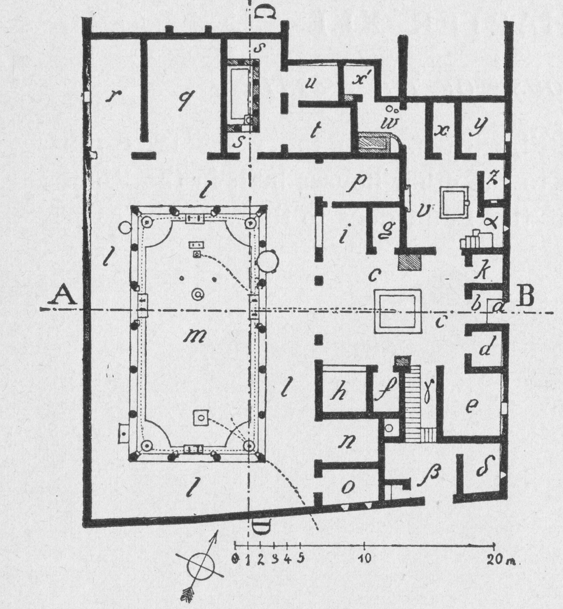

- **Style / era:** Ancient Roman domus, 1st century AD (plan published 1907)
- **Type:** house (Roman domus) | **Country:** Italy
- **Creator:** August Mau | **Source:** Public-domain plate from Mau, 'Pompeii: Its Life and Art' (1907); via Wikimedia Commons
- **License:** [Public Domain](<https://commons.wikimedia.org/wiki/File:Floor_Plan_of_the_House_of_the_Vettii_Pompeii_(VI_15,1)_by_August_Mau_1907.jpg>)
- **Source page:** [link](<https://commons.wikimedia.org/wiki/File:Floor_Plan_of_the_House_of_the_Vettii_Pompeii_(VI_15,1)_by_August_Mau_1907.jpg>) | **Full-res file:** [link](<https://commons.wikimedia.org/wiki/Special:FilePath/Floor_Plan_of_the_House_of_the_Vettii_Pompeii_(VI_15,1)_by_August_Mau_1907.jpg?width=1600>)

This is August Mau's 1907 plan of the House of the Vettii at Pompeii, a textbook example of the Roman domus. The plan is drawn with thick masonry walls in black poché and is organized around two open-air voids in the classic Roman sequence. From the street, a narrow entrance passage (the fauces) leads into a roughly square atrium on the right side of the house, with a small rectangular impluvium basin marked at its center to catch rainwater. Around the atrium cluster the small bedrooms (cubicula) and side recesses (alae), and beyond it lie the reception and service rooms.

The dominant space is the large peristyle garden courtyard, room "m" on the left, occupying nearly half the footprint. It is a colonnaded ring: a rectangular ambulatory of solid floor wrapping a central open garden, with the columns drawn as a regular ring of dots on all four sides. Geometrically this is a room polygon with a hole in the middle, the garden being open to the sky inside the covered walkway. Every room is labeled with a single letter (a through z and beyond) keyed to a separate printed legend, so the plan gives no inscribed dimensions at all; size is read from the legend and the scale bar. A compass rose with an arrow sits at the lower left and a metric graphic scale bar ("0 1 2 3 4 5 ... 10 ... 20 m") runs along the bottom, with a section line A-B crossing the plan.

This domus is a focused test of several gaps at once. The peristyle is the canonical courtyard-with-a-hole, and the atrium with its impluvium is a smaller open-air court, both of which the current model only marks best-effort. The covered colonnaded ambulatory around the garden is a roofed-but-open space rather than an enclosed room. The lettered room key replaces drawn dimensions entirely, and the plan carries a north arrow and scale bar. The walls themselves are straight, so the geometry of individual rooms is mostly representable; what makes this plan demanding is the courtyard/atrium voids, the colonnade, the legend, and the orientation annotations.

**Notable features**

- classic Roman domus sequence: fauces, atrium, tablinum, peristyle
- atrium with a central impluvium basin (small open-air court)
- large colonnaded peristyle garden courtyard as a room polygon with a hole
- regular ring of columns drawn as dots around the garden ambulatory
- every room labeled with a single letter keyed to a printed legend
- compass rose north arrow and metric graphic scale bar
- section line A-B drawn across the plan
- thick masonry walls in black poché, all straight segments

**Supported today:** straight walls forming many small rectangular rooms (cubicula, alae), thickness-aware walls and wall junctions, room polygons and custom-polygon overrides for irregular rooms, raster underlay with scale calibration to trace the historic plate.

**On the roadmap:** wall construction profiles / poché for thick masonry walls, site/textual metadata for a named excavated house, era registry tagging (ancient Roman domus).

**Not yet supported today (gaps). Draft feature requests:**

- [Courtyard and atrium spaces (open-air interior courts)](../../../vernacular-planning/feature-courtyard-and-atrium-spaces.md): the peristyle is a covered ring around an open garden (a room polygon with a hole) and the atrium is a smaller open-air court with an impluvium
- [Covered outdoor rooms (porches, verandas, breezeways)](../../../vernacular-planning/feature-covered-outdoor-rooms.md): the colonnaded ambulatory around the peristyle garden is a roofed-but-open walkway, not a fully wall-enclosed room
- [Room schedules and legends (indirect room sizing)](../../../vernacular-planning/feature-room-schedule-and-legend.md): rooms are identified entirely by single letters keyed to a separate legend, with no inscribed dimensions on the plan
- [Plan annotations: north arrow and scale bar](../../../vernacular-planning/feature-plan-annotations-north-arrow-scale-bar.md): the plate carries a compass-rose north arrow and a graphic metric scale bar as drawn annotations

---

## 29. Plan d'un hotel particulier (Francois-Joseph Belanger)

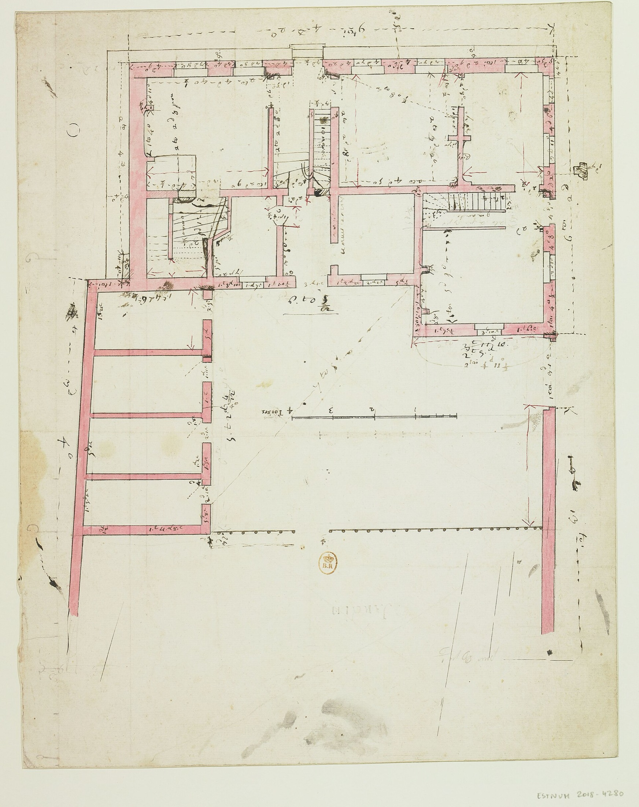

- **Style / era:** French Neoclassical, late 18th century
- **Type:** townhouse (hotel particulier) | **Country:** France
- **Creator:** Francois-Joseph Belanger (1744-1818), draughtsman | **Source:** Bibliotheque nationale de France (Gallica); via Wikimedia Commons
- **License:** [Public Domain](https://commons.wikimedia.org/wiki/File:Plan_d%27un_h%C3%B4tel_particulier_-_dessin_-_Fran%C3%A7ois-Joseph_B%C3%A9langer_-_btv1b10029350k.jpg)
- **Source page:** [link](https://commons.wikimedia.org/wiki/File:Plan_d%27un_h%C3%B4tel_particulier_-_dessin_-_Fran%C3%A7ois-Joseph_B%C3%A9langer_-_btv1b10029350k.jpg) | **Full-res file:** [link](https://commons.wikimedia.org/wiki/Special:FilePath/Plan_d%27un_h%C3%B4tel_particulier_-_dessin_-_Fran%C3%A7ois-Joseph_B%C3%A9langer_-_btv1b10029350k.jpg?width=1600)

This is a hand-drawn presentation plan for a Parisian hotel particulier by the Neoclassical architect Francois-Joseph Belanger. Unlike the printed engravings in this set, it is an original ink-and-wash drawing: the walls are laid in with a pink/rose poché wash and the dimensions are written by hand in ink throughout, in period French numerals. A Bibliotheque nationale stamp sits near the lower center. The drawing reads a little roughly because it is a working presentation sheet rather than a clean diagram.

The main residential block runs along the top of the sheet, a band of principal rooms and service spaces packed with partition walls. It contains at least three staircases: two of them are curved or winding stairs (drawn as fanned, tapering treads) and one is a straight-run flight with parallel treads. At least one room on the right has a curved bay or apsidal end, a bowed wall recess sketched in. Below and to the left, a long narrow service wing of small repeated rooms extends down the left edge. The large open area filling the lower half of the sheet is the property's outdoor ground: a row of dots marks a colonnade or portico bounding a court or garden, with the cour d'honneur on the entrance side and the garden beyond, the characteristic court-and-garden arrangement of the French townhouse type. A graphic scale bar sits in the middle of the sheet.

For Vernacular this plan combines several gaps. The curved/apsidal salon walls and the winding stairs both need nonlinear geometry the Phase-1 editor lacks. More fundamentally, the drawing is a site plan: it lays out the building between an entrance court and a garden, with a colonnade and the open grounds drawn as geometry, not just the enclosed building footprint. The colonnade/portico itself is a roofed-but-open space rather than an enclosed room. The straight-walled interior rooms and the handwritten linear dimensions are otherwise within reach of the current editor (the dimensions are inscribed numbers, not a lettered legend), so the demanding parts are the curved geometry, the court-and-garden site layout, and the open colonnade.

**Notable features**

- original hand-drawn ink-and-wash plan with pink/rose poché walls
- handwritten inscribed dimensions in period French numerals
- three staircases: two curved/winding plus one straight-run
- curved bay / apsidal salon end in the main block
- long narrow service wing of small repeated rooms
- court-and-garden layout: cour d'honneur, colonnade, and garden grounds
- colonnade/portico drawn as a row of dots bounding the open court
- central graphic scale bar

**Supported today:** straight walls forming the partitioned interior rooms and service wing, thickness-aware walls and wall junctions, handwritten linear inscribed dimensions (not a lettered legend), raster underlay with scale calibration to trace the original drawing.

**On the roadmap:** straight-run stair (2D symbol) for the parallel-tread flight, wall construction profiles / poché for masonry walls, site/textual metadata for an aristocratic townhouse, era registry tagging (French Neoclassical).

**Not yet supported today (gaps). Draft feature requests:**

- [Curved and non-linear walls](../../../vernacular-planning/feature-curved-and-nonlinear-walls.md): a salon has a curved bay/apsidal end and two stairs are curved/winding, all needing nonlinear geometry
- [Site and landscape plans (lot, grounds, outdoor geometry)](../../../vernacular-planning/feature-site-and-landscape-plan.md): the sheet lays out the building between an entrance court and a garden, drawing the cour d'honneur and grounds as geometry rather than only the building footprint
- [Covered outdoor rooms (porches, verandas, breezeways)](../../../vernacular-planning/feature-covered-outdoor-rooms.md): the colonnade/portico bounding the court is a roofed-but-open space, not a fully wall-enclosed room
- [Vertical circulation beyond straight stairs (elevators, spiral stairs, ramps)](../../../vernacular-planning/feature-vertical-circulation-beyond-stairs.md): two of the staircases are curved/winding rather than straight-run flights

---

## 30. Drayton Hall, Basement Plan (HABS SC-377, sheet 3)

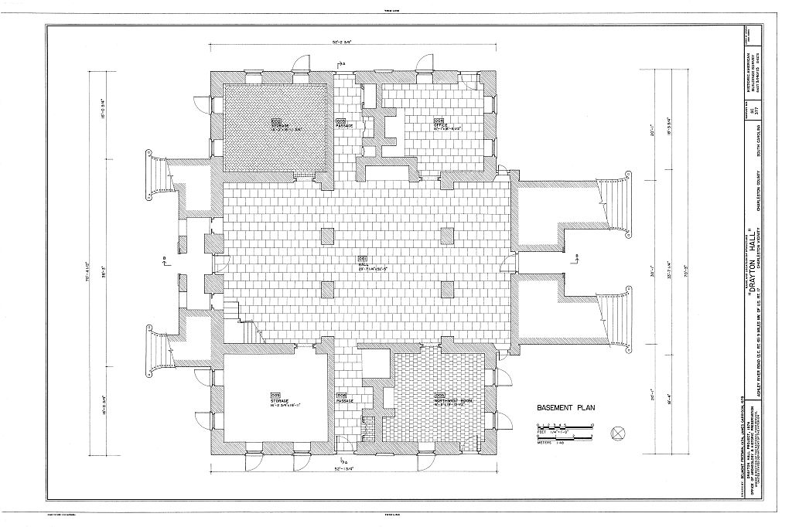

- **Style / era:** Georgian, house built circa 1738-1742; HABS drawings documented 1979
- **Type:** estate / plantation house | **Country:** United States
- **Creator:** Historic American Buildings Survey; delineators John A. Burns, James B. Garrison, Laura L. Hochuli, Charles Edwin Chase | **Source:** Library of Congress HABS
- **License:** [US Government Work](https://www.loc.gov/rr/print/res/114_habs.html)
- **Source page:** [link](https://www.loc.gov/item/sc0132/) | **Full-res file:** [link](https://tile.loc.gov/storage-services/service/pnp/habshaer/sc/sc0100/sc0132/sheet/00003v.jpg)

This is the basement (ground-story) plan of Drayton Hall, a circa-1738 Georgian plantation house near Charleston, South Carolina, documented by the Historic American Buildings Survey. The plan is rigorously symmetrical about a central axis. A large central Hall occupies the middle of the block, and within it a regular five-by-three grid of small square piers (drawn as solid filled squares) carries the principal-floor structure above. Flanking the hall, the corners hold clearly labeled service rooms: Storage and Passage at upper left, Office at upper right, and Storage, Passage, and a Northwest Room across the bottom. Each room is named with its dimensions written directly beneath the label.

The most striking graphic quality is the wall construction. Every wall is thick load-bearing masonry, rendered with a dense brick-coursing hatch (poché) that gives the plan real weight and shows the depth of the foundation walls. Doorways punch through these heavy walls with quarter-circle swing arcs, and small window or vent openings are spaced along the exterior. Two monumental exterior stairs project from the left and right elevations, drawn as flared, splaying flights with curved cheek walls that step out from the building line toward the grounds.

The sheet is fully measured: continuous imperial dimension strings run along all four sides, capturing overall width, room widths, and wall offsets, and a combined feet-and-meters graphic scale bar with a north/orientation symbol sits beside the BASEMENT PLAN title. The geometry itself is entirely orthogonal and straight-edged, so the room shapes and the rectangular plan are well within a conventional editor's reach.

For Vernacular this plan exercises straight walls, junctions, named rectangular rooms, doors with swing symbols, and dense imperial dimensioning, all of which are supported today. Its distinctive needs are roadmap items rather than gaps: thick masonry wall construction with brick poché belongs to the wall-construction-profile track, the basement is one level of a multi-floor stack, and the graphic scale bar and orientation symbol are plan annotations. The deeply projecting exterior stairs that splay outward and the building's placement as the main house of a larger plantation point beyond the single-building, drawn-on-lot model.

**Notable features**

- rigorously symmetrical Georgian plan about a central axis
- large central Hall with a regular grid of square structural piers
- thick load-bearing masonry walls drawn as dense brick poche
- named, dimensioned service rooms (Storage, Passage, Office, Northwest Room)
- doors with quarter-circle swing arcs cut through heavy walls
- two monumental flared exterior stairs projecting from the side elevations
- continuous imperial dimension strings on all four sides
- feet-and-meters graphic scale bar plus orientation symbol

**Supported today:** straight orthogonal walls and wall junctions, named rectangular rooms with labels and dimensions, single and double door swing symbols, continuous linear imperial dimension strings, wall thickness.

**On the roadmap:** thick masonry wall construction profiles with brick poche, multi-floor management (this is the basement level of a stacked house), graphic scale bar and orientation symbol as plan annotations, straight-run stairs as a 2D symbol.

**Not yet supported today (gaps). Draft feature requests:**

- [Multi-building properties (multiple structures on one site)](../../../vernacular-planning/feature-multi-building-properties.md): this is the main house of a larger plantation estate documented with dependencies and a separate site plan; the model is single-building
- [Site and landscape plans (lot, grounds, outdoor geometry)](../../../vernacular-planning/feature-site-and-landscape-plan.md): the deeply projecting flared exterior stairs splay out onto the grounds and the sheet implies the building's placement on the plantation lot, which is site geometry rather than building interior

---

## 31. Villa Barbaro at Maser plan, from I quattro libri dell'architettura

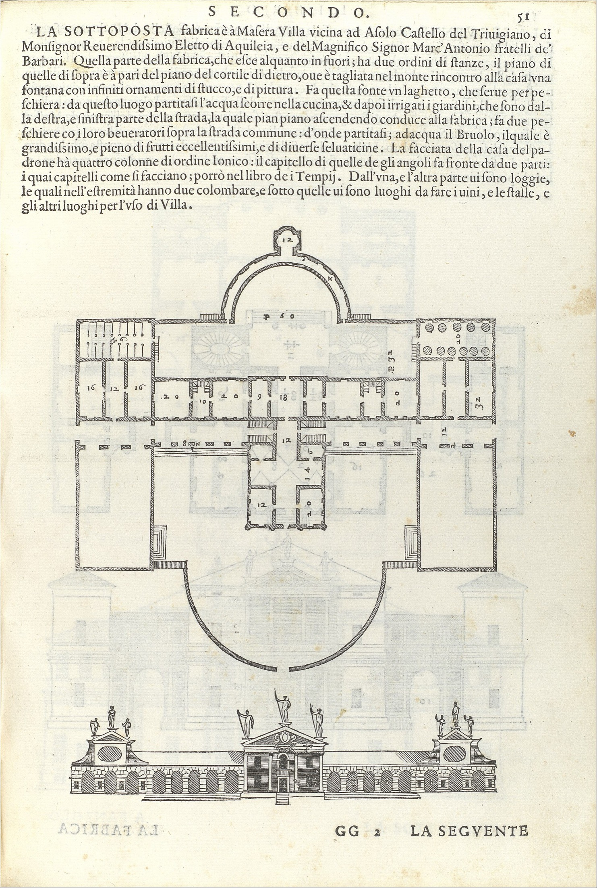

- **Style / era:** Renaissance / Palladian, 1570
- **Type:** estate | **Country:** Italy
- **Creator:** Andrea Palladio (delineator); plate from I quattro libri dell'architettura | **Source:** Metropolitan Museum of Art (Open Access); via Wikimedia Commons
- **License:** [CC0 1.0](http://creativecommons.org/publicdomain/zero/1.0/deed.en)
- **Source page:** [link](<https://commons.wikimedia.org/wiki/File:Villa_Barbaro,_from_I_quattro_libri_dell%27architettura_di_Andrea_Palladio_(Book_2,_page_51)_MET_DP109543.jpg>) | **Full-res file:** [link](<https://commons.wikimedia.org/wiki/Special:FilePath/Villa_Barbaro,_from_I_quattro_libri_dell%27architettura_di_Andrea_Palladio_(Book_2,_page_51)_MET_DP109543.jpg?width=1600>)

This is Andrea Palladio's own woodcut plate of the Villa Barbaro at Maser, published in I quattro libri dell'architettura in 1570. The sheet combines two drawings: a ground plan in the upper register and a front elevation across the bottom, framed by a page of Italian letterpress describing the villa. The composition is emphatically axial and mirror-symmetric, the defining trait of Palladio's villa-farms.

The plan reads as a multi-building villa estate drawn as one continuous composition. At the center sits the compact residential block, a tight cluster of square and rectangular rooms arranged around a cruciform central hall. From each side of this core a long, straight arcaded service wing (the barchessa, an agricultural arcade) extends outward as a colonnade of repeated open bays, and each wing terminates in a square corner pavilion, the dovecotes that bracket the ensemble. Behind the house a large semicircular form is drawn into the plan, the curved exedra or nymphaeum garden court that closes the composition with an apsidal, circular wall rather than a straight one.

The elevation below shows the same parti in three dimensions: the central pedimented temple-front villa rising in the middle, the two low arcaded wing fronts running out to either side, and pedimented end pavilions stopping each wing. Statuary crowns the rooflines. Because this is a Renaissance engraving, there are no dimension strings, room labels, or scale bar; the room identities and proportions are conveyed entirely by the drawing and the accompanying prose rather than by measured annotation.

For Vernacular, the central residential block and the straight, repeated-bay wings are largely drawable with straight walls and rectangular rooms today. Its real demands are the genuine gaps: it is one composition holding several distinct structures (house plus two service wings plus end pavilions), the open arcaded barchesse are roofed-but-unenclosed colonnades rather than walled rooms, and the semicircular garden exedra is a true curved wall. The lack of any drawn dimensions or scale bar also means size must come from the legend-and-prose tradition rather than from on-plan measurement.

**Notable features**

- mirror-symmetric Palladian villa-farm parti drawn as one composition
- compact central residential block of rooms around a cruciform hall
- two long straight arcaded service wings (barchesse) of repeated open bays
- square corner pavilions (dovecotes) terminating each wing
- large semicircular garden exedra / nymphaeum behind the house
- combined plan-plus-elevation Renaissance woodcut plate
- no dimension strings or scale bar; size implied by drawing and prose

**Supported today:** straight orthogonal walls and junctions in the residential core, rectangular rooms around a central hall, repeated-bay straight wing walls, wall thickness.

**On the roadmap:** era registry / period tagging (Renaissance / Palladian), room-purpose registry for villa and service-wing rooms.

**Not yet supported today (gaps). Draft feature requests:**

- [Multi-building properties (multiple structures on one site)](../../../vernacular-planning/feature-multi-building-properties.md): one composition holds several distinct structures: the central villa plus two long service wings ending in corner pavilions/dovecotes
- [Covered outdoor rooms (porches, verandas, breezeways)](../../../vernacular-planning/feature-covered-outdoor-rooms.md): the barchesse are roofed but open arcaded colonnades, not fully wall-enclosed rooms
- [Curved and non-linear walls](../../../vernacular-planning/feature-curved-and-nonlinear-walls.md): the semicircular garden exedra / nymphaeum behind the house is a true curved (apsidal) wall
- [Room schedules and legends (indirect room sizing)](../../../vernacular-planning/feature-room-schedule-and-legend.md): the engraving carries no on-plan dimensions or labels; room identity and size come from the accompanying prose legend rather than drawn measurement

---

## 32. Blenheim Palace overall plan (from Vitruvius Britannicus)

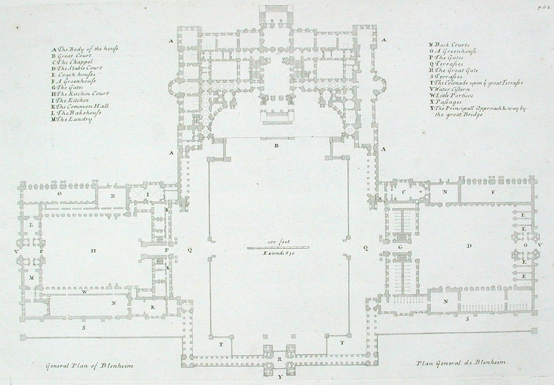

- **Style / era:** English Baroque, 1725
- **Type:** palace / estate | **Country:** United Kingdom
- **Creator:** Unknown delineator; engraving from Colen Campbell, Vitruvius Britannicus (1725) | **Source:** Public-domain 18th-century engraving; via Wikimedia Commons
- **License:** [Public Domain](https://commons.wikimedia.org/wiki/File:Blenheim_overall_plan.jpg)
- **Source page:** [link](https://commons.wikimedia.org/wiki/File:Blenheim_overall_plan.jpg) | **Full-res file:** [link](https://commons.wikimedia.org/wiki/Special:FilePath/Blenheim_overall_plan.jpg?width=1600)

This is the general ground plan of Blenheim Palace, engraved for Colen Campbell's Vitruvius Britannicus in 1725. It depicts one of the largest English Baroque country houses as a single monumental composition, and a lettered legend (A through Y) runs down both margins keying every block and space on the sheet. The plan is symmetric about a strong central north-south axis.

The heart of the plan is an enormous Great Court (B), an open rectangular forecourt closed at its head by a bowed colonnade and reached from the south along The Principall Approach and way by the great Bridge (Y). The deep main Body of the house (A) sits across the top, a dense warren of state rooms, a chapel, and stair compartments. The most important feature for a multi-building reading is the pair of large, largely detached service ranges that flank the great court left and right. The left range encloses the Kitchin Court (I) and houses the chapel, common hall, kitchen, bakehouse, and laundry; the right range encloses the Stable Court and holds the coach houses, stables, and greenhouses. Each of these wings is its own quadrangle wrapped around an interior open-air court.

Architecturally the plan is rich in covered and open-air outdoor space. Long arcaded colonnades (the Colonade upon ye great Terrasse, U) and little porticoes (W) edge the terraces; gates, a water cistern, and back courts are all called out. The two flanking quadrangles are textbook courtyard-and-atrium spaces, with their building footprints forming rings around open courts. A centered graphic scale bar reads 100 feet and notes the plan extends 830 feet, giving a sense of the sheer scale; there are no numeric dimension strings, so size is read from the bar and the legend.

For Vernacular this is a stress test well beyond the single-building model. Straight walls and rectangular rooms cover the bulk of the geometry, but the genuine gaps dominate: it is unmistakably a multi-building estate (main house plus two detached service quadrangles plus stable and coach blocks), it is organized around multiple open-air courts with ring-shaped footprints, it includes arcaded colonnades and porticoes that are roofed but open, and the surrounding terraces, gates, bridge approach, and water cistern are site and landscape geometry. The lettered legend and graphic scale bar replace on-plan dimensions entirely.

**Notable features**

- monumental symmetric Baroque estate plan keyed by an A-Y legend
- enormous central Great Court closed by a bowed colonnade
- deep main body of the house with state rooms, chapel and stairs
- two detached service quadrangles: Kitchen Court and Stable Court
- stables, coach houses, greenhouses, bakehouse and laundry called out
- arcaded colonnades and little porticoes edging the terraces
- terraces, gates, water cistern and the great-bridge approach
- centered graphic scale bar (100 feet, extends 830) with no numeric strings

**Supported today:** straight orthogonal walls and junctions, rectangular rooms across the main house and service ranges, wall thickness.

**On the roadmap:** room-purpose registry (chapel, kitchen, stables, greenhouse, laundry), graphic scale bar as a plan annotation, site metadata for the named estate.

**Not yet supported today (gaps). Draft feature requests:**

- [Multi-building properties (multiple structures on one site)](../../../vernacular-planning/feature-multi-building-properties.md): one sheet holds the main house plus two largely detached service quadrangles and stable/coach blocks, far beyond a single building
- [Courtyard and atrium spaces (open-air interior courts)](../../../vernacular-planning/feature-courtyard-and-atrium-spaces.md): the great court and the two flanking service quadrangles are open-air courts whose building footprints form rings around them
- [Covered outdoor rooms (porches, verandas, breezeways)](../../../vernacular-planning/feature-covered-outdoor-rooms.md): the bowed colonnade, the colonnade upon the great terrace, and the little porticoes are roofed but open arcaded spaces, not enclosed rooms
- [Site and landscape plans (lot, grounds, outdoor geometry)](../../../vernacular-planning/feature-site-and-landscape-plan.md): the surrounding terraces, gates, water cistern, and great-bridge approach are site and landscape geometry rather than building interior
- [Curved and non-linear walls](../../../vernacular-planning/feature-curved-and-nonlinear-walls.md): the bowed colonnade closing the head of the great court is a curved wall segment
- [Room schedules and legends (indirect room sizing)](../../../vernacular-planning/feature-room-schedule-and-legend.md): spaces are identified by an A-Y marginal legend keyed to letters on the plan, with size read from a graphic scale bar rather than drawn dimensions

---

## 33. McNamee-Torbert House, Site Plan and Historic Site Plan (HABS AL-892, sheet 2)

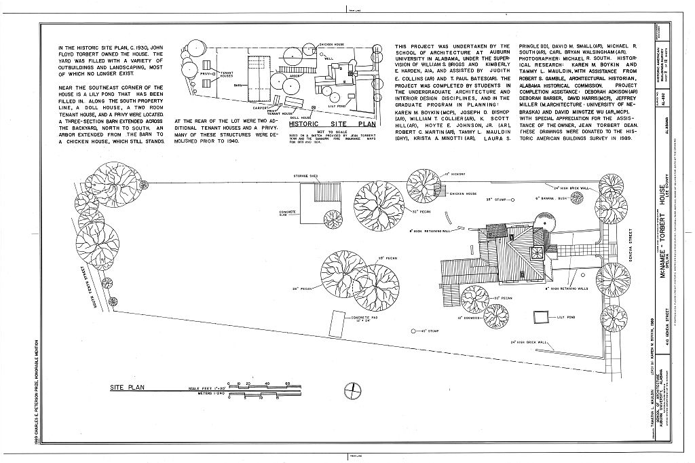

- **Style / era:** Queen Anne Victorian, house circa late 19th century; HABS drawings documented 1989
- **Type:** single-family house with detached outbuildings (multi-building property) | **Country:** United States
- **Creator:** Historic American Buildings Survey (Auburn University School of Architecture); delineator Krista A. Minotti and others | **Source:** Library of Congress HABS
- **License:** [US Government Work](https://www.loc.gov/rr/print/res/114_habs.html)
- **Source page:** [link](https://www.loc.gov/item/al0904/) | **Full-res file:** [link](https://tile.loc.gov/storage-services/service/pnp/habshaer/al/al0900/al0904/sheet/00002v.jpg)

This Historic American Buildings Survey sheet for the McNamee-Torbert House, a Queen Anne Victorian in Opelika, Alabama, is not a room plan at all but a pair of site plans, which makes it a clean test of property-scale rather than building-scale drawing. Two blocks of explanatory text frame the drawings: one narrates the circa-1930 yard with its now-vanished outbuildings and landscaping, the other gives the Auburn University project credits.

The upper drawing is a small, not-to-scale HISTORIC SITE PLAN reconstructing the property around 1930. It shows the main house surrounded by a scatter of detached outbuildings, each labeled: a chicken house, tenant house or houses, a carport, a doll house, a three-section barn, a privy, a well, and a lily pond. This is the multi-building character stated explicitly, a single domestic property whose life happened across a dozen separate small structures.

The lower drawing is the measured current SITE PLAN at one inch to twenty feet. It maps the whole irregular lot, bounded along one edge by Seneca Street, with the main house pushed to the right side and the rest of the yard documented in detail: many individually labeled trees (pecans, hickory, dogwood, with trunk diameters noted), tree stumps, brick retaining walls of several heights, a concrete pad, a storage shed, a surviving chicken house, and a filled-in lily pond. A graphic scale bar in feet and meters and a north arrow anchor the drawing.

For Vernacular almost everything here is a genuine gap because the subject is the lot, not the interior. The dominant needs are multi-building properties (a house plus chicken house, tenant houses, doll house, barn, privy, storage shed, carport) and full site-and-landscape geometry (lot boundary, street edge, retaining walls, walks, the lily pond, planting, and individually surveyed trees). The north arrow and scale bar are plan annotations, and the legend-style labeling of trees and structures stands in for drawn dimensions. There is essentially no conventional walled-room content to exercise the Phase 1 editor.

**Notable features**

- two site plans on one sheet: a c.1930 historic reconstruction and a measured current plan
- main house surrounded by many labeled detached outbuildings
- historic outbuildings: chicken house, tenant houses, carport, doll house, three-section barn, privy, well
- irregular lot bounded by Seneca Street at one inch to twenty feet
- individually labeled trees with trunk diameters, stumps, and a filled lily pond
- brick retaining walls of several heights, a concrete pad, and a storage shed
- north arrow and feet-and-meters graphic scale bar
- explanatory narrative text instead of room dimensions

**Supported today:** raster image underlay with scale calibration (the sheet itself as a tracing base), straight wall segments for outbuilding and house footprints.

**On the roadmap:** era registry / period tagging (Queen Anne Victorian), textual site metadata for the property, north arrow and graphic scale bar as plan annotations.

**Not yet supported today (gaps). Draft feature requests:**

- [Multi-building properties (multiple structures on one site)](../../../vernacular-planning/feature-multi-building-properties.md): the property is a main house plus many detached outbuildings (chicken house, tenant houses, doll house, barn, privy, carport, storage shed); the model is single-building
- [Site and landscape plans (lot, grounds, outdoor geometry)](../../../vernacular-planning/feature-site-and-landscape-plan.md): the sheet is dominated by lot boundary, street edge, retaining walls, walks, lily pond, and individually surveyed trees, which is site and landscape geometry
- [Room schedules and legends (indirect room sizing)](../../../vernacular-planning/feature-room-schedule-and-legend.md): structures and trees are identified by on-drawing text labels and narrative paragraphs rather than drawn room dimensions

---

## 34. Obici House - Carriage House (HABS VA-1438-A, plans sheet 1)

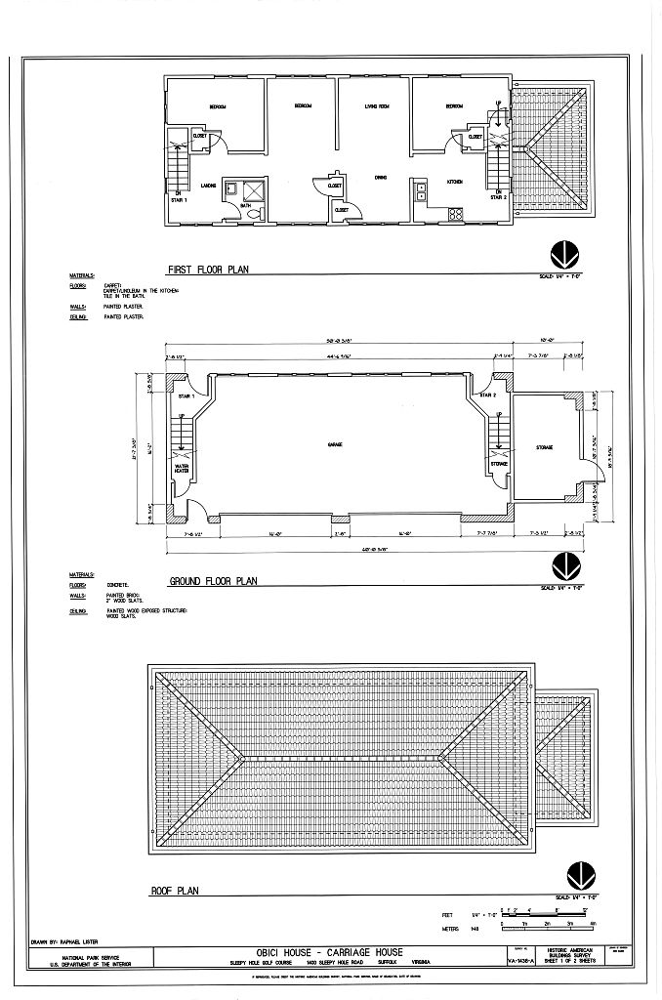

- **Style / era:** Early-20th-century estate carriage house / garage with upper dwelling, Obici estate (Planters Peanuts founder Amedeo Obici); HABS drawings
- **Type:** accessory dwelling / carriage house (garage below, apartment above) | **Country:** United States
- **Creator:** Historic American Buildings Survey (HABS VA-1438-A), delineated by Raphael Lister | **Source:** Library of Congress HABS (Prints & Photographs Division)
- **License:** [US Government Work / Public Domain](https://www.loc.gov/rr/print/res/114_habs.html)
- **Source page:** [link](https://www.loc.gov/item/va2130/) | **Full-res file:** [link](https://tile.loc.gov/storage-services/service/pnp/habshaer/va/va2100/va2130/sheet/00001v.jpg)

This Historic American Buildings Survey sheet documents the carriage house of the Obici estate in Suffolk, Virginia, the property of Planters Peanuts founder Amedeo Obici. The carriage house is a detached accessory building serving a separately documented main residence, and it is itself a mixed-use, two-level structure: a garage below with a full apartment above. The sheet stacks three drawings vertically, each with its own materials note and a north arrow and scale bar.

The middle drawing is the GROUND FLOOR PLAN. It is dominated by a single large open garage bay, flanked at the left by a stair (with a water-heater closet tucked beside it) and at the right by a second stair leading up to storage rooms at that end. Painted brick walls with two-inch wood slats are noted, and the bay is wrapped with full imperial dimension strings giving overall and bay widths. The top drawing is the FIRST FLOOR PLAN, the upstairs dwelling: three bedrooms, a living room, a separate dining area and kitchen, a bathroom, and several closets, served by the same two stairs (Stair 1 opening off a landing on the left, Stair 2 on the right). A hip-roofed porch or terrace, drawn with diagonal hatch, projects at the right end.

The bottom drawing is a ROOF PLAN, showing the hipped roof of the whole building as shingle hatch with its ridge and hip lines, including the lower hip over the projecting end bay. The three plans together give a complete vertical reading of the building, two occupiable floors plus the roof, which is why this is a good multi-level and two-stair test case.

For Vernacular the bulk of the interior is squarely supported: straight orthogonal walls, named rectangular rooms (bedrooms, kitchen, bath, garage, storage), doors, closets, and full imperial dimension strings. The roadmap items it exercises are multi-floor management (two stacked occupied levels) and straight-run stairs (two of them). Its genuine gaps are that it is one of several structures on an estate, an accessory building to a documented main house, and that it is a dwelling stacked over a garage, a small mixed-use, single-structure-with-an-upper-unit case. The hip-roofed projecting porch is a roofed-but-open outdoor room, and the roof plan itself is roof-and-slope geometry rather than a floor.

**Notable features**

- detached estate carriage house: garage below, full apartment above
- three stacked drawings on one sheet: ground floor, first floor, roof plan
- large open garage bay flanked by two stairs and storage rooms
- upstairs dwelling with three bedrooms, living, dining, kitchen, and bath
- two stairways (Stair 1 with landing, Stair 2) spanning both floors
- hip-roofed projecting porch/terrace drawn with diagonal hatch
- roof plan with hipped shingle hatch and ridge/hip lines
- full imperial dimension strings and per-plan materials notes

**Supported today:** straight orthogonal walls and junctions, named rectangular rooms (bedrooms, kitchen, bath, garage, storage), doors and closet openings, continuous linear imperial dimension strings, wall thickness.

**On the roadmap:** multi-floor management (two stacked occupied levels plus a roof plan), straight-run stairs as 2D symbols with floor-spanning topology, roof plan / complete underlay, north arrow and graphic scale bar as plan annotations.

**Not yet supported today (gaps). Draft feature requests:**

- [Multi-building properties (multiple structures on one site)](../../../vernacular-planning/feature-multi-building-properties.md): this is a detached accessory carriage house, one of several structures on the Obici estate whose main residence is documented separately
- [Multi-unit dwellings (apartments, duplexes, shared circulation)](../../../vernacular-planning/feature-multi-unit-dwellings.md): a self-contained apartment is stacked over a garage in one structure, a small mixed-use dwelling-over-service arrangement beyond the single-residence model
- [Covered outdoor rooms (porches, verandas, breezeways)](../../../vernacular-planning/feature-covered-outdoor-rooms.md): the hip-roofed projecting porch/terrace at the right end is a roofed but open space rather than an enclosed room
- [Roof and sloped-ceiling geometry](../../../vernacular-planning/feature-roof-and-sloped-ceiling-geometry.md): the sheet includes a dedicated roof plan of the hipped roof with ridge and hip lines, which is roof geometry not a floor

---

## 35. A-Frame Cabins, First and Second Floor Plans (USDA Plan 5964/5965)

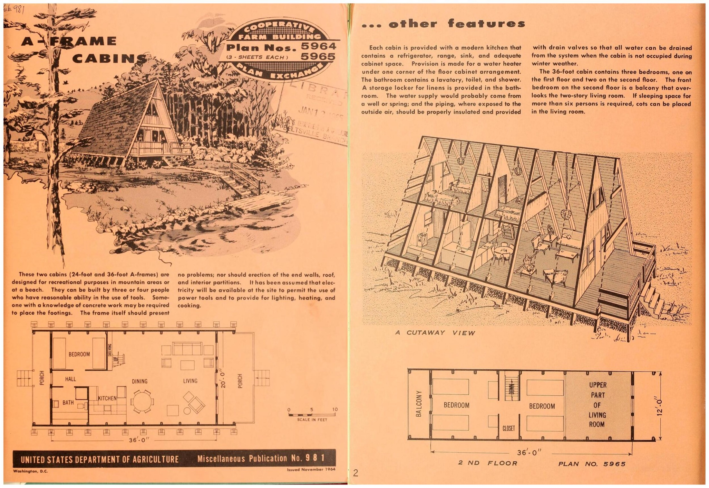

- **Style / era:** Mid-century A-frame, issued November 1964
- **Type:** single-family recreation cabin (A-frame) | **Country:** United States
- **Creator:** U.S. Department of Agriculture, Cooperative Farm Building Plan Exchange | **Source:** U.S. Department of Agriculture; scanned by the National Agricultural Library via the Internet Archive; mirrored on Wikimedia Commons
- **License:** [Public Domain (US Government Work)](<https://commons.wikimedia.org/wiki/File:A-frame_cabins_(IA_aframecabins981unit).pdf>)
- **Source page:** [link](<https://commons.wikimedia.org/wiki/File:A-frame_cabins_(IA_aframecabins981unit).pdf>) | **Full-res file:** [link](https://archive.org/details/aframecabins981unit)

This is a public-domain U.S. Department of Agriculture leisure-cabin plan from 1964, distributed through the Cooperative Farm Building Plan Exchange, and it fills the A-frame gap directly. The cover sheet pairs a woodland perspective of the cabin with a dimensioned first-floor plan: a long, narrow 36 by 20 foot rectangle holding a bedroom, bath, kitchen, dining, and living room off a central hall, with a porch at each gable end and a graphic scale bar instead of dimension strings. The footprint and rooms themselves are ordinary rectangles, so the plan view reads as a simple, supported layout.

What makes it an A-frame is everything the plan view cannot show on its own, which is why the second page is so useful here. The interior cutaway section makes the triangular cross-section explicit: there are no vertical exterior walls at all, just two steeply pitched roof planes that meet at the ridge and serve as both the walls and the ceiling. The second-floor plan shows two bedrooms and a balcony tucked under those sloping planes, around a void labeled "upper part of living room" where the upper floor is open to the double-height living space below.

For the editor this is a compact bundle of gaps. The defining geometry is the sloped roof-wall surface, which a straight-walled, flat-ceiling model cannot represent, and the second floor is a holed plate open to the room below. The two end porches are roofed but open, post-supported bays rather than enclosed rooms. The rectangular floor plate, the named rooms, and the two stacked levels are otherwise supported or on the roadmap; it is the A-frame section and the double-height void that push past it.

**Notable features**

- genuine A-frame: the steeply pitched roof planes are the walls and the ceiling
- interior cutaway section makes the triangular cross-section explicit
- double-height living room with a second-floor balcony open above it
- compact 36 by 20 foot rectangular floor plate
- two gable-end porches drawn as open, post-supported bays
- first floor: bedroom, bath, kitchen, dining, living, hall; second floor: two bedrooms and a balcony
- graphic scale bar in feet rather than full dimension strings

**Supported today:** the rectangular 36 by 20 foot footprint and its straight-walled, right-angled rooms, room naming and labels; door and window plan symbols, a single-floor plan view of either level on its own.

**On the roadmap:** multi-floor (a two-story cabin), straight-run stairs linking the two levels.

**Not yet supported today (gaps). Draft feature requests:**

- [Roof and sloped-ceiling geometry](../../../vernacular-planning/feature-roof-and-sloped-ceiling-geometry.md): the A-frame has no vertical exterior walls; its steeply pitched roof planes are the walls and ceiling, and the upper floor sits under those sloping surfaces, which a straight-walled flat-ceiling model cannot represent
- [Courtyard and atrium spaces (open-air interior courts)](../../../vernacular-planning/feature-courtyard-and-atrium-spaces.md): the 'upper part of living room' is a double-height void where the second-floor plate is open to the living room below, so the upper floor polygon has a hole
- [Covered outdoor rooms (porches, verandas, breezeways)](../../../vernacular-planning/feature-covered-outdoor-rooms.md): the porch bay at each gable end is a roofed but open, post-supported space rather than an enclosed room
- [Plan annotations: north arrow and scale bar](../../../vernacular-planning/feature-plan-annotations-north-arrow-scale-bar.md): the sheet sizes the plan with a graphic scale bar in feet rather than with dimension strings

---

## 36. Accessible Toilet Room with 60-inch Turning Space (US Access Board)

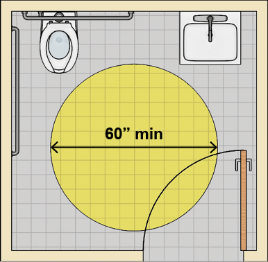

- **Style / era:** Barrier-free / universal design (ADA), 2010 ADA Standards guidance
- **Type:** accessible room plan (toilet room) | **Country:** United States
- **Creator:** U.S. Access Board | **Source:** U.S. Access Board, Guide to the ADA Standards, Chapter 6 (Toilet Rooms)
- **License:** [Public Domain (US Government Work)](https://www.access-board.gov/ada/guides/chapter-6-toilet-rooms/)
- **Source page:** [link](https://www.access-board.gov/ada/guides/chapter-6-toilet-rooms/) | **Full-res file:** [link](https://www.access-board.gov/images/ada-aba/guides/chapter6/toilet-rooms/32.png)

This is a public-domain figure from the U.S. Access Board's Guide to the ADA Standards, and it represents the accessible-unit gap at room scale. The drawing is a plan view of a small accessible toilet room whose every dimension is governed by accessibility, not by the shape of the room. A large yellow circle marked "60 inch min" fills the floor: the minimum wheelchair turning space. Around it sit a water closet with side and rear grab bars, a lavatory placed so its knee space does not intrude on the circle, and an entry door whose swing is kept clear of the turning space. A measured grid backdrop expresses the clearances.

It is included as the clearest possible illustration of the single most iconic accessibility requirement, the wheelchair turning circle, isolated at room scale. Its whole-unit companion is plan 37, a complete accessible apartment from the same family of federal guidance that shows these same rules governing an entire home. Despite being a single room, this figure captures the defining feature of accessible design: a layout driven by turning circles, grab-bar zones, and fixture clear floor space.

For the editor the room outline and the door swing are ordinary, and the fixtures belong to the planned assets work. The gap is everything that makes the plan accessible. There is no way today to place a turning circle, mark a clear floor space at a fixture, reserve a grab-bar zone, or check that a door swing stays out of the route. An accessibility-clearance layer that can draw and verify these spaces is the missing capability, and it matters for the old-house and senior-living audiences the project cares about.

**Notable features**

- the plan is organized around a 60-inch minimum circular wheelchair turning space
- water closet with side and rear grab bars at code clearances
- lavatory positioned to leave the turning circle clear
- entry door swing kept out of the required clear floor space
- a measured grid backdrop expressing the clearance dimensions
- a barrier-free design where the clearances, not the room shape, drive the layout

**Supported today:** the rectangular room outline and its straight walls, a door plan symbol with a swing arc.

**On the roadmap:** fixtures (water closet, lavatory) as placed assets from the furniture and assets track.

**Not yet supported today (gaps). Draft feature requests:**

- [Accessibility clearances and turning spaces](../../../vernacular-planning/feature-accessibility-clearances-and-turning-spaces.md): the entire plan is defined by accessibility clearances (a 60-inch turning circle, grab-bar zones, and fixture clear floor space) and a route kept free of door swings, none of which the editor can express or check

---

## 37. Accessible Dwelling Unit with 36-inch Route Through the Unit (HUD)

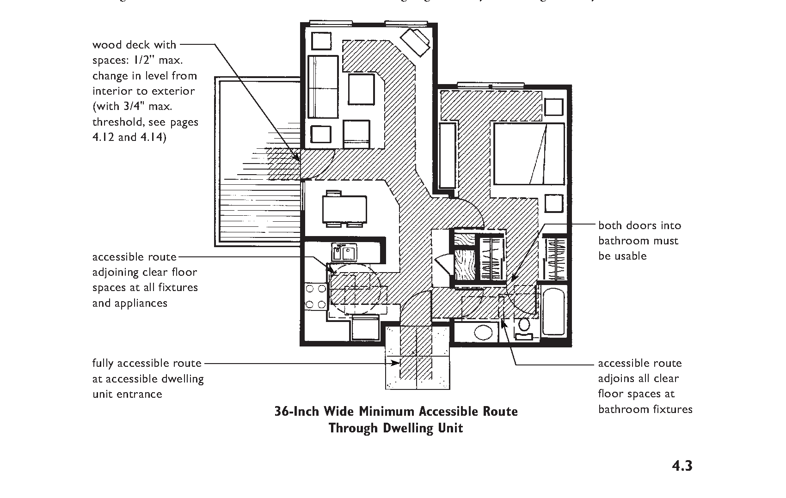

- **Style / era:** Barrier-free / universal design (Fair Housing Act), 1998 (HUD Fair Housing Act Design Manual)
- **Type:** accessible dwelling unit (one-bedroom apartment) | **Country:** United States
- **Creator:** U.S. Department of Housing and Urban Development, Office of Fair Housing and Equal Opportunity | **Source:** HUD, Fair Housing Act Design Manual (1998), Chapter 4 'Accessible Route Into and Through the Covered Dwelling Unit', page 4.3
- **License:** [Public Domain (US Government Work)](https://www.huduser.gov/portal/publications/fairhsg/fhefhag.html)
- **Source page:** [link](https://www.huduser.gov/portal/publications/fairhsg/fhefhag.html) | **Full-res file:** [link](https://www.huduser.gov/portal/publications/PDF/FAIRHOUSING/fairch4.pdf)

This is the whole accessible dwelling unit the corpus was missing, a public-domain figure from HUD's Fair Housing Act Design Manual (Chapter 4, "Accessible Route Into and Through the Covered Dwelling Unit"). It shows a complete one-bedroom apartment: a living room with seating, a kitchen, a bedroom, two bathrooms, and a wood deck, drawn with furniture and fixtures in place so the clearances read as real space rather than abstract rules.

The organizing idea is the shaded band that runs through the plan, captioned "36-Inch Wide Minimum Accessible Route Through Dwelling Unit." It enters at the accessible unit entrance, threads through every room, and adjoins the clear floor space at each kitchen appliance and each bathroom fixture. Callouts around the edge spell out the requirements: a fully accessible route at the entrance, the route adjoining clear floor spaces at all fixtures and appliances, both doors into the bathroom being usable, and the wood deck reached with no more than a half-inch change in level.

For the editor the rooms, walls, doors, and door swings are ordinary, and the furniture and fixtures belong to the planned assets work. The gap is the accessibility logic that defines the plan. There is no way today to draw an accessible route, reserve a clear floor space at a fixture, require a turning space, or check that the route actually reaches every appliance and fixture and that doors stay usable along it. This unit pairs with the room-scale turning-circle figure elsewhere in the corpus: that one isolates a single clearance, while this one shows the same rules governing a whole home, which is the case the old-house and senior-living audiences care about most.

**Notable features**

- a complete one-bedroom apartment unit, not just a single room
- a shaded 36-inch minimum accessible route threading from the entrance through every room
- the route adjoins clear floor space at all kitchen appliances and all bathroom fixtures
- two bathrooms, both required to have usable doors
- a wood deck reached with a 1/2 inch maximum change in level
- callouts annotating the route, the clearances, and the door requirements
- furniture and fixtures drawn in to show the clearances are real

**Supported today:** the straight-walled, right-angled rooms and the overall unit footprint, room layout with doors and door swings, a single-floor apartment plan.

**On the roadmap:** furniture and fixtures (sofa, bed, kitchen appliances, bathroom fixtures) as placed assets.

**Not yet supported today (gaps). Draft feature requests:**

- [Accessibility clearances and turning spaces](../../../vernacular-planning/feature-accessibility-clearances-and-turning-spaces.md): the entire unit is organized around an accessible route of a minimum width that must adjoin clear floor space at every appliance and fixture, with turning space in the kitchen and baths; the editor cannot draw a route, reserve clear floor space, or verify the route reaches every fixture
- [Covered outdoor rooms (porches, verandas, breezeways)](../../../vernacular-planning/feature-covered-outdoor-rooms.md): the wood deck is an exterior space attached to the unit and joined to it by the accessible route, not an enclosed interior room

---
